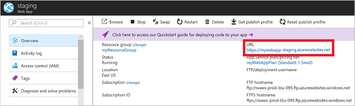

Create a staging slot for your Web App in the Azure portal:

1. Open the Azure portal at [https://portal.azure.com](https://portal.azure.com) and sign in to your Azure account.
2. From the navigation bar on the left-hand side of the screen, choose *Resource groups*.
3. Choose the resource group you created for your Web App, such as *myResourceGroup*, then select your Web App, such as *myWebApp*.
4. On the left-hand side of the Web App window, select **Deployment slots**, then choose to **Add Slot**.
5. Enter a name for your deployment slot, such as *staging*, then select your existing Web App for the *Configuration source*. To create the deployment slot, select **OK**.
6. Once the deployment slot has been created, select it from the list of available slots. The overview for the deployment slot is shown, including the URL. The deployment slot is added to name of your web app, such as *https://mywebapp-staging.azurewebsites.net*:

    

Select the URL to open in a new web browser window. Leave the Azure portal and staging slot web site browser windows open.