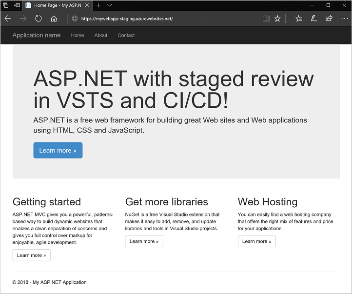

## Lab exercise 5 - Create Web App staging slot and deploy for review with VSTS CI/CD pipeline

First, create a staging slot for your Web App in the Azure portal:

1. Open the Azure portal at [https://portal.azure.com](https://portal.azure.com) and sign in to your Azure account.
2. From the navigation bar on the left-hand side of the screen, choose *Resource groups*.
3. Choose the resource group you created for your Web App, such as *myResourceGroup*, then select your Web App, such as *myWebApp*.
4. On the left-hand side of the Web App window, select **Deployment slots**, then choose to **Add Slot**.
5. Enter a name for your deployment slot, such as *staging*, then select your existing Web App for the *Configuration source*. To create the deployment slot, select **OK**.
6. Once the deployment slot has been created, select it from the list of available slots. The overview for the deployment slot is shown, including the URL. The deployment slot is added to name of your web app, such as *https://mywebapp-staging.azurewebsites.net*:

    

Select the URL to open in a new web browser window. Leave the Azure portal and staging slot web site browser windows open.

### Update VSTS build definition to publish to Web App staging slot

To use your Web App staging slot, update the build definition in VSTS project:

1. In your VSTS project browser open, choose **Build & Release**, then select **Builds**.
2. Choose your build definition, such as *myWebApp-Azure Web App-CI*, then select **Edit**.
3. On the left-hand side of your build definition, select **Azure App Service Deploy: myWebApp**.
4. Check the box *Deploy to slot*, then select your resource group from the drop-down list, such as *myResourceGroup*.
5. From the *Slot* drop-down menu, select your Web App staging slot, such as *staging*:

    

6. To save the updated build definition, select **Save & queue**, then choose **Save**. Add a comment, such as *Updating to use staging slot*, then select **Save**.

### Edit app and push new commit from Visual Studio

Update your app in Visual Studio, then commit and push the changes to see your app now deployed to the Web App staging slot in Azure.

1. In Visual Studio, open the **Solution Explorer** window.
2. Navigate to and open *myWebApp | Views | Home | Index.cshtml*
3. Edit line 6 to read:

    `<h1>ASP.NET with staged review in VSTS and CI/CD!</h1>`

4. Save the file.
5. Open the **Team Explorer** window, select the *myWebApp* project, then choose **Changes**.
6. Enter a commit message, such as *Deploying to staging slot*, then choose **Commit All and Sync** from the drop-down menu.
7. In Team Services workspace, a new build is triggered from the code commit.
    - Choose **Build & Release**, then select **Builds**.
    - Choose your build definition, then select the **Queued & running** build to watch as the build progresses.
8. To see your changes applied once the build has successfully completed, refresh your staging web site in a browser, such as *https://mywebapp-staging.azurewebsites.net*:

    

9. To confirm that your production site has not changed, refresh the production web site in a browser.

### Swap staging slot to production deployment

After review of your app in staging, you can swap the Web App deployments to make your site live in production.

1. In the Azure portal for your Web App staging slot, select **Swap**
2. For **Source**, choose your staging slot, such as *staging*.
3. Choose *production* as the **Destination**, then select **OK**.
4. It takes a few seconds for the Web App deployment slots to swap. Once finished, refresh your production web site in a browser:

    