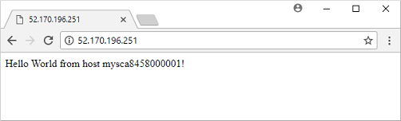

In the [previous unit](./create-vmss.md) we saw our scale set in action, with a web browser open and displaying the default NGINX page.  
If we now refresh that web page, it will display the output from our basic Node.js app. It shows a greeting along with the name of the VM instance in the scale set on which this instance of our app is running. If you refresh the page a few times, the load balancer should distribute you to another VM instance. This output is illustrated in the following screenshot. 

Let's the web browser open for now.  In the next unit, we'll update the app to a newer version from GitHub.