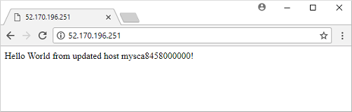

To see the updated version, refresh the site from the previous module in your browser. Notice the change in app output in the following screenshot.




## Cleanup Module Resources
To clean up the scale set resources and Packer image created in this module, use [az group delete]. The `--yes` parameter confirms that you wish to delete the resources without an additional prompt to do so. The `--no-wait` parameter returns control to the prompt without waiting for the operation to complete:

```azurecli
az group delete --name myResourceGroup --yes --no-wait
```