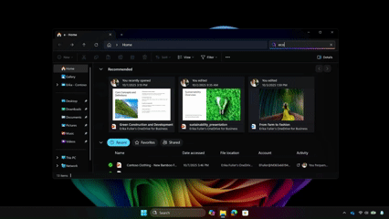
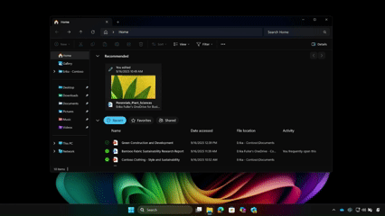
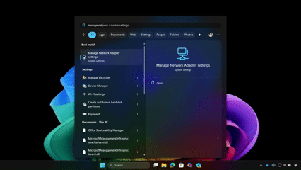

Traditional search requires remembering exact file names or locations. Improved Windows Search removes that dependency by understanding intent and context.

Improved Windows Search is available directly within Windows, making it easy to find what you need without switching between tools. You can access it from the taskbar’s Windows Search box, File Explorer, or Settings, so you can readily find what you’re looking for. Use the taskbar search box for quick, broad searches across apps, files, and settings, and use File Explorer when you want to focus on files within a specific location.

## Search for files, apps, or content

1. Select the **Windows Search box** on the taskbar or press the **Windows key**.

1. Type what you remember using natural language.

   Example: “budget presentation” or “photos from beach trip”

1. Review the results as they appear.

1. Select the most relevant file, app, or result.

Instead of relying on exact matches, Windows surfaces results based on meaning, recent activity, and relevance. Improved Windows Search uses AI to interpret intent, so even vague or incomplete queries can return relevant results.

*Use the taskbar search box to quickly find files, apps, and settings by describing what you remember.*

## Search within File Explorer

Use File Explorer when you want to narrow your search to a specific location.

1. Open **File Explorer**.

1. Select a folder or choose **This PC** to search across your device.

1. Use the **search bar** in the top-right corner.

1. Enter a descriptive query, such as:  

   - “documents from last month”
   - “Excel file with sales data”

This is especially useful when you remember what a file contains or when it was used, but not where it’s stored.

*Search within File Explorer to narrow results by location and quickly find files based on their content, relevance, or recent activity.*

## Search for settings

You can also use improved search to quickly access system settings.

1. Open the **search box** or the **Settings** app.

1. Type what you want to do instead of the exact setting name.  

   Example: “connect a device” or “make screen brighter”

1. Select the suggested setting from the results.

Windows maps your intent to the appropriate setting, eliminating the need to navigate through menus.

*Find system settings by typing what you want to do, without needing to navigate menus.*

## Optimize search results with indexing

Improved Windows Search automatically indexes common locations on your device. You can expand this to improve search coverage.

1. Open **Settings**.
1. Select **Privacy & Security**.
1. Choose **Searching Windows**.
1. Select one of the following:

   - **Classic:** This mode indexes your Documents, Pictures, and Music folders plus the desktop by default. It's suitable for users who primarily store their files in these locations. Classic mode provides a balance between search performance and system resource usage.  

   - **Enhanced:** This mode indexes your entire PC, including all user folders and files. It's ideal for users who store files in various locations across their device. Enhanced mode provides more comprehensive search results but might use more system resources.

   Choose Classic if you mainly work within standard folders like Documents and Desktop. Choose Enhanced if your files are spread across multiple locations and you want more complete search results.

To add another location for indexing, select **Customize search locations**, then choose **Modify** to see Indexed locations and select the folders you want to add.
