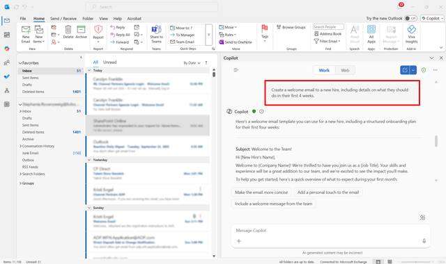

Microsoft Outlook includes Copilot Chat, an AI assistant that helps you quickly understand and act on your emails. You can use it to summarize long email threads, highlight key decisions, and identify action items—so you spend less time scrolling and more time getting work done.

## Copilot Chat in Outlook can:

- Summarize long email threads
- Draft replies based on context
- Highlight action items or deadlines
- Search for emails by topic, sender, or urgency
- Identify tasks or meetings mentioned in emails

> [!IMPORTANT]
> What you can do with Copilot Chat in Outlook depends on whether or not your admin assigned a Microsoft 365 Copilot add-on license to your work or school account.
>
> **Copilot Chat without an add-on license**: If you don't have a Microsoft 365 Copilot add-on license with your work or school account, you can still use Copilot Chat in Outlook to ask questions about individual emails, threads, or calendar events that you're viewing, and their attachments.
>
> *"Summarize this email for the top three main points and any action items I need to take."*
>
> *"Write a recap email for my team based on the discussion in this email thread."*
>
> **Copilot Chat with an add-on license**: If you have a Microsoft 365 Copilot add-on license with your work or school account, you'll be able to use Copilot Chat in Outlook to interact with your entire inbox and calendar using prompts such as:
>
> *"Which unread emails are most important? Summarize them."*
>
> *"Tell me when my next meeting with my skip-level manager is scheduled."*
>
> *"Create a welcome email to a new hire, including details on what they should do in their first four weeks."*
>
>

## How Copilot Chat summarizes emails

When you ask Copilot Chat to summarize a thread:

- It identifies the main points and decisions in the conversation.

- It highlights action items you're responsible for.

- It can create a concise summary suitable for forwarding or referencing later.

## Best practices for summarizing email threads

Keep these tips in mind when using Copilot Chat in Outlook:

- **Verify critical details**: Confirm dates, names, and assignments in the summary before taking action.

- **Use the summary to plan next steps**: Turn action items into tasks or schedule meetings directly from the summary.

- **Share when needed**: Forward the summary to teammates to keep everyone aligned without sending the full thread.

> [!TIP]
> You can ask Copilot Chat to highlight action items specifically by typing: *"List my follow-up tasks from this email thread."* This helps you prioritize what needs immediate attention.
