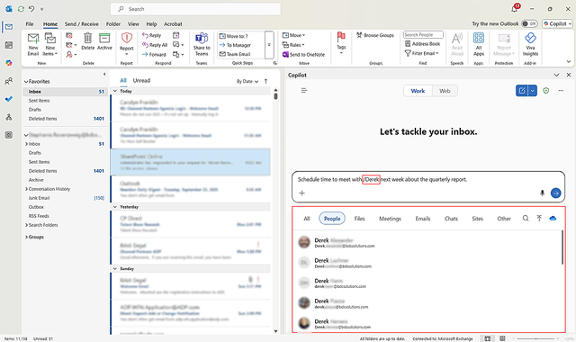

Coordinating follow-ups and action items from long email threads is essential for staying organized. In this exercise, you’ll practice using Copilot Chat in Outlook to summarize a complex email thread, identify key decisions, and extract actionable tasks. This activity shows you how to use Copilot to focus in on essential information so you can take action on emails faster.

> [!IMPORTANT]
> Chat with Copilot is only available in new Outlook for Windows and Outlook on the web. Microsoft 365 Copilot is available on other Outlook clients.

## Steps

1. Open Outlook and locate a long or complex email thread in your inbox.

2. Select Copilot Chat in the ribbon.

3. Type the prompt:
*"Summarize this email thread and highlight action items for me."*

4. Review the summary for accuracy:

   - Confirm names, dates, and deadlines.
   - Ensure all key decisions are captured.

5. Take action based on the summary:

   - Add tasks to Outlook Tasks or To Do.
   - Schedule meetings or follow-ups if needed.

Chat Assisted Scheduling in Outlook allows users to schedule meetings and block time directly through Copilot Chat. This feature simplifies the process of finding available times, setting up appointments, and organizing meetings to make your workday smoother and more efficient.

Start by entering the meeting participant details in the chat or using the forward slash (/) to search for a specific person using the Context IQ feature. Specify the time range, and Copilot finds available times for the meeting. You can also include the meeting duration and title. For example, *"Schedule time to meet with Derek next week about the quarterly report."*

For larger meetings, Copilot​​​​​​​ guides you to complete the scheduling in the event form, prepopulating the details and suggested time slots that work best for you.​​​​​

6. **Optional**: Ask Copilot to create a concise summary for your team:
*"Summarize this thread in 3–5 bullet points for my team."*

> [!TIP]
> ​​​​​​​If you have a work or school account and a qualifying Microsoft 365 business subscription, Copilot Chat is now available for you to use in Word, Excel, PowerPoint, Outlook, and OneNote. How you use Copilot in the apps can depend on what you're licensed for.