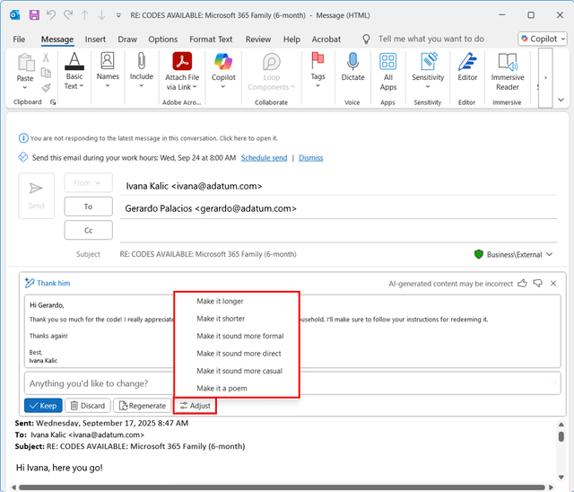

Microsoft Outlook with Copilot Chat helps you respond to emails efficiently, ensuring your replies are professional, clear, and accurate. Instead of manually composing responses to long or complex email threads, Copilot Chat can generate suggested replies based on the conversation. This saves you time, ensures nothing is missed, and helps you maintain a consistent tone in your communications.

## How Copilot Chat drafts replies

When you use Copilot Chat to draft a reply:

- It reviews the email thread and highlights key points and action items.

- It generates a professional draft reply that addresses the important points.

- You remain in control—review, edit, and send the draft when it’s ready.

## Best practices

- **Verify critical details**: Always check names, dates, and key points in the draft.

- **Adjust tone and style**: Ensure the reply is appropriate for your audience and context.

- **Use the draft as a starting point**: Copilot speeds up drafting, but you have full control over the final message.

> [!TIP]
> Heading out on vacation or have an appointment where you won't be available?
>
> Ask Copilot to set up automatic replies and optionally provide the dates and times you want to enable this for. An interactive card appears in chat allowing you to modify, confirm, or jump to settings for more in-depth control.
>
>Try the prompt: *"Set up an automatic reply for [Date/Time]"*