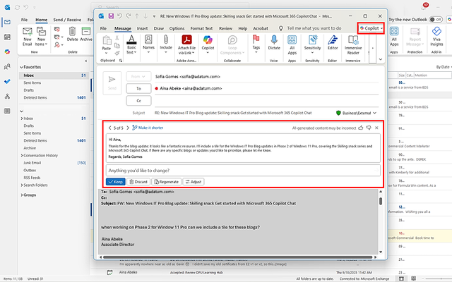

Responding to emails quickly and professionally is essential for keeping projects on track and maintaining clear communication with colleagues and clients. In this exercise, you’ll practice using Copilot Chat in Outlook to draft replies to email threads. You’ll review a thread, generate a draft reply, and customize it for clarity and tone. This hands-on activity will help you respond efficiently while maintaining professionalism.

## Steps

1. Open a long or complex email thread in Outlook that requires a response.

2. Select Copilot Chat in the ribbon.

3. Type the prompt:
*"Draft a professional reply to this thread confirming next steps."*

4. Review the draft generated by Copilot Chat:

   - **Check for accuracy of details** such as names, dates, and deadlines.
   - **Ensure the tone is appropriate** for your audience.

5. Edit the draft as needed to personalize the message or clarify points.

6. Send the email when you're satisfied with the content.

> [!TIP]
>
> Use Copilot’s draft as a starting point, not a final version; always verify details. Make sure to include any context or attachments needed for clarity. Remember to maintain a professional tone that fits the recipient and situation.