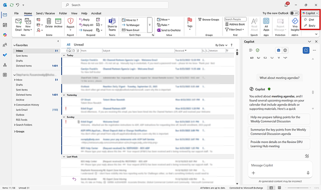

Managing your inbox efficiently ensures that important messages don’t get lost and that you can focus on what matters most. In this exercise, you’ll practice using Copilot Chat in Outlook to create a rule that automatically organizes incoming emails based on sender or other conditions. This hands-on activity will save you time and help keep your inbox structured.

## Steps

1. Open Outlook and select Copilot Chat from the ribbon.

2. In the chat box, type a prompt describing the rule you want to create. For example:

   *“Move all emails from the sender [email address] to my Deleted Items folder.”*

3. Copilot generates a proposed rule and ask for confirmation. Review the rule carefully:

   - Check the action (for example, move to folder, flag for follow-up).

   - Check the condition (for example, sender, subject, keywords).

4. Confirm the rule by clicking Yes (or the equivalent confirmation button).

5. Copilot provides a link to manage your rules if you want to edit, disable, or delete it later.

> [!TIP]
>
> Be specific in your prompt to Copilot about both the action and the condition. You can combine multiple actions in one rule (for example, move + flag + categorize). Review the rule before confirming to ensure it only affects the emails you intend.