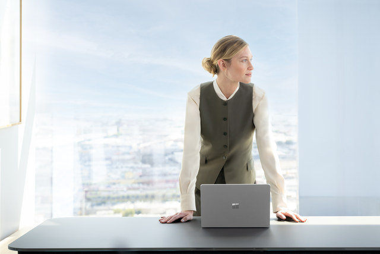

Work moves fast, and you need tools that can help you stay productive, flexible, and focused. Microsoft 365 Copilot can act as your AI assistant built right into the apps you already use every day.1 And whether you're typing up a report, jotting down notes with a pen,2 or presenting, there are Surface devices that can adapt to your needs.

Imagine this: You have an important meeting coming up, and you need a polished presentation fast. You’ve also realized that using more natural input methods can help you stay focused and think more clearly. With your Surface device, you can use the Surface Slim Pen 2 to help you annotate ideas, the Studio Microphone with Voice Clarity technology to help you dictate content, and Copilot to help you generate, summarize, and refine your slides.

# Disclaimers

1. Microsoft 365 Personal, Family, or Premium subscription required; AI features only available to subscription owner and cannot be shared; usage limits apply. [Learn more](https://go.microsoft.com/fwlink/?linkid=2280151). Minimum age limits may apply to use of AI features. [Details](https://support.microsoft.com/office/frequently-asked-questions-about-copilot-in-microsoft-365-subscriptions-bda0d6e8-346d-41ce-ab1e-f6af6229c462).
2. Sold separately. Software license required for some features.
