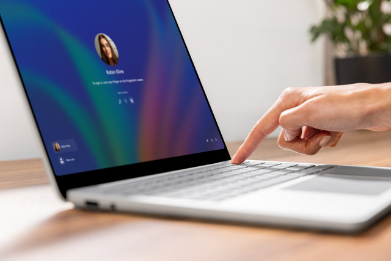

Surface devices include features that enhance AI-powered workflows and secure your data:

- **Neural Processing Unit (NPU):** Surface Copilot+ PCs process AI operations on a dedicated processor, so slide generation, text rewriting, and summarization using Copilot happens faster.
- **Windows Studio Effects:** Includes AI-enhanced live captioning, background blur, and noise suppression, which help with collaborative meetings and presentations.
- **Security features:** Trusted Platform Module 2.0, Windows Hello for Business, and Microsoft Pluton are security features that help safeguard data and identities.

Using Copilot with Surface also supports collaboration:

- Share project outlines in OneNote with colleagues in real-time.
- Dictate notes while using Surface Studio Microphone or Surface Headphones for clear audio.
- Have Copilot provide meeting notes and follow-up tasks from collaborative calls in Microsoft Teams.

***Reflection:** How could using AI-enhanced collaboration features like live captioning or smart annotations improve the clarity of team communications?*
