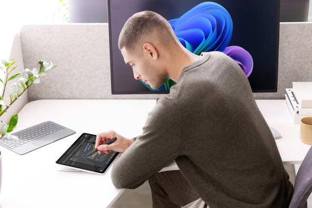

Your team is brainstorming a project plan. Notes are scattered across sticky notes, emails, and rough drafts. You want to organize them efficiently using Copilot, Surface Slim Pen 2, and Studio Microphone.

Before you begin, bring all your rough materials together, so Copilot has the full picture.

### Step 1: Gather notes

- **Compile your notes:** Gather emails, meeting minutes, screenshots, sticky notes, and rough drafts you’ve collected across devices. You can paste them directly into OneNote or attach them using the Insert menu.
- **Add handwritten ideas:** Use your Surface Slim Pen 2 to write down reminders, sketch connections, or add questions in the margins. Copilot can help read and interpret your handwriting as easily as typed notes.
- **Capture dictated thoughts:** If you think faster than you type, use your Surface Studio Microphone to dictate quick thoughts right into OneNote. Voice Clarity helps ensure your speech is transcribed accurately for Copilot to use later.

### Step 2: Open OneNote and launch Copilot

1. Sign in to Microsoft 365 on your Surface device.
2. Open OneNote and navigate to your working section or create a new page.
3. Select the Copilot icon in the top menu to open the Copilot pane.
4. Begin interacting:
    1. **Type your prompt**
    1. **Use your voice** with the Studio Microphones for hands-free input
    1. **Write a prompt with the Slim Pen 2**, which OneNote converts to text automatically
1. Invite collaborators: Share the OneNote page or notebook with teammates so they can co-edit in real time as you begin shaping content.

> [!TIP]
> Surface supports fluid input switching—begin writing with the pen, then jump to voice or touch without losing your flow.

### Step 3: Generate a structured outline

1. Enter a prompt, such as:  
   *"Convert these notes into a structured project outline. Group similar items, remove duplicates, and label clear sections."*
2. Copilot can help analyze your pasted notes, handwriting, and dictated text to help create:
   - Logical sections  
   - Grouped ideas  
   - Clean headings and subheadings  
   - A reorganized, easy-to-read structure
3. Review Copilot’s outline and:
   - Use the Surface Slim Pen 2 to circle areas to keep or cross out items you want removed.
   - Add margin notes indicating what Copilot should adjust.
   - Tap and drag sections using touch to reorder items.

### Step 4: Extract action items and timeline

1. Prompt Copilot with something like:  
   *"Identify tasks, owners, and deadlines from these notes. Create a simple timeline or checklist."*
2. Copilot can help:
   - Pull out tasks hidden in your notes  
   - Suggest due dates  
   - Create a visual or bulleted timeline  
   - Convert scattered items into actionable steps
3. Use touch or Surface Slim Pen 2 to adjust:
   - Reassign tasks  
   - Add missing deadlines  
   - Mark items as high-priority

> [!TIP]
> With pen input, you can draw arrows between tasks or sketch timeline ideas that Copilot can help convert into a clean, digital format.

### Step 5: Refine and finalize

Use Copilot to polish your outline into a ready-to-share artifact.

Ask Copilot to:

  - Simplify the language
  - Remove redundant points
  - Emphasize priority items
  - Add a summary section
  - Format using headings, bullets, or tables

### Step 6: Collaborate on a Microsoft Teams call

> [!TIP]
> If you're creating the meeting, be sure to enable Facilitator. Facilitator is a meeting assistant in Microsoft Teams that can help keep meetings organized and productive. The Teams admin must allow the Facilitator app in the Teams Admin Center. Loop experiences must also be turned on in your organization. Keep in mind, Facilitator works only in scheduled meetings, not in channel meetings or ad-hoc calls.

1. Start the call
   1. Open Microsoft Teams on your Surface device.
   2. Select Meet now or join a scheduled meeting with your team.

> [!TIP]
> Before entering the call, open Device settings and enable Windows Studio Effects, such as:
>
>- Automatic framing to help you stay centered even if you move.
>- Background blur to help remove visual distractions.
>- Voice focus / noise suppression to help eliminate typing, room noise, or echo.

2. Begin the collaborative review

   Once in the meeting, greet the team and briefly set expectations for the review session (for example, "We’ll walk through the outline and timeline and confirm ownership for each task").

   Make sure your Surface Slim Pen 2 and touch controls are ready if you want to annotate the page live during the discussion.

3. Share your OneNote workspace

   1. Select Share in Teams → choose the OneNote window or entire desktop.
   2. Navigate to the OneNote page containing your outline, timeline, and action items.
   3. Encourage teammates to follow along in the shared notebook directly if they already have access.

4. Review and edit content together by walking through each section of the outline.

> [!TIP]
> Pause to gather input or confirm decisions. Make live edits using touch or the Surface Slim Pen 2 so everyone can see changes in real time. Allow collaborators to add comments or update tasks simultaneously in OneNote when coauthoring is enabled.

5. Finalize outcomes

   1. Summarize the decisions made during the call—for example, confirmed deadlines, updated owners, or sections needing follow-up.
   2. Save and sync the OneNote page so all participants have the latest version instantly.
   3. End the call knowing everyone is aligned around the final project plan and next steps.

> [!TIP]
> If Facilitator was enabled, you can refer back to the AI-generated meeting summary and tasks assigned during the call.

***Reflection:** Did using multimodal input make organizing the project faster? Did AI help the Teams meeting run smoothly? How could these tools improve collaboration in your own projects?*
