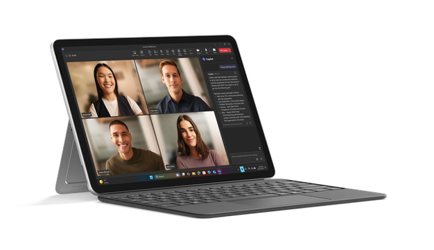

You needed to prepare a presentation and organize project notes while saving time and reducing typing. By using Surface features and Microsoft 365 Copilot, you were able to draft, refine, and finalize content more quickly and collaboratively.

Without these tools, creating polished slides and structured project plans might require more manual effort, slower iterations, and could increase the risk of missing details. When you need to focus on higher-value work, improve collaboration, and complete tasks more efficiently, Microsoft 365 Copilot and Surface can help support your efforts.

