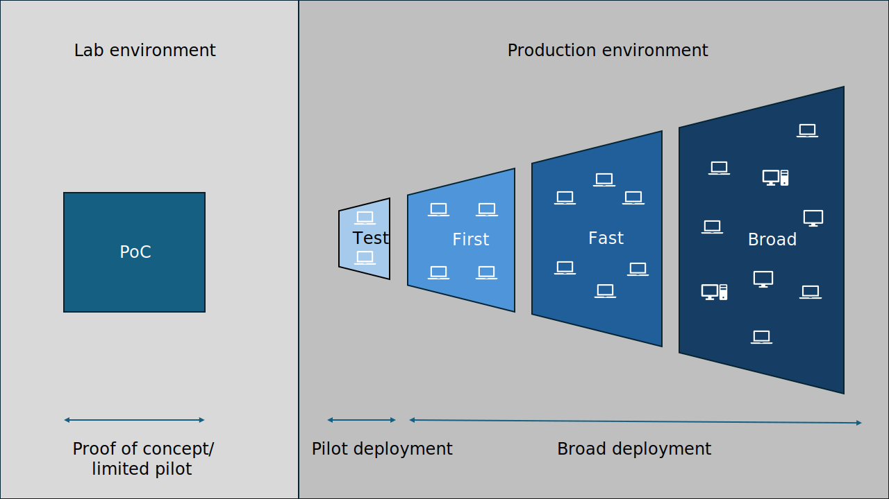

Let’s begin by determining your operational readiness for Windows 11 deployment. This includes identifying any gaps that you’ll need to close in the next phase. Here's a list of tasks and deliverables that we recommend to evaluate your readiness in this area:

| Tasks | Deliverables |
|-------|--------------|
| - Define operational readiness criteria. - Define deployment rings/phases. - [Optional] Define a Proof of Concept (PoC). - Identify and assign roles to personnel. - Define servicing channel for devices. - Hardware refresh plan. - Define device update strategy. - Design a feedback loop. - Identify gaps. | A table of operational readiness criteria - Deployment plan (including required number of deployment phases or rings, dates, and device upgrade strategy) - [Optional] List of devices and tests to be performed in a PoC - Roles and responsibilities or RACI tables for tasks - List of devices requiring a servicing channel other than the default - Hardware refresh plan - Documented feedback process - List of operational gaps |

## Define operational readiness criteria

When you deploy a Windows 11 feature update, you'll need to make sure it isn't introducing new operational issues. Additionally, you'll need to ensure that if incidents arise, the required documentation and processes are available. To achieve this, work with your operations and support teams to define acceptable trends and identify which documents or processes require updating:

- **Call trend:** Define what percentage increase in calls relating to the Windows 11 feature update are acceptable or can be supported.
- **Incident trend:** Define what percentage increase in incident tickets asking for support relating to Windows 11 are acceptable or can be supported.
- **Support documentation:** Identify supporting documentation that requires an update. Focus on supporting new infrastructure tooling or configuration as part of the Windows 11 feature update.
- **Process changes:** Identify any processes that will change as a result of the Windows 11 feature update.

> [!NOTE]
> ***Recommended deliverable:***
>
> Document these operational readiness criteria in a format that allows sharing, such as a table.

## Define deployment rings or phases

In a service management model, you need effective ways of rolling out updates to representative groups of devices. Many organizations have found that a ring-based deployment works well. Deployment rings in Windows clients are like the deployment groups most organizations constructed for previous major revision upgrades. They're simply a method to separate devices into a deployment timeline or phases.

At the highest level, each ring comprises a group of users or devices that receive a particular update concurrently. For each ring, you'll define which devices to include, when to start offering the feature update, and the deadline by which it should be installed. You might also wish to offer users the ability to install the update on their own schedule.

There are no definite rules for exactly how many rings to have for your deployments or how quickly you should move through the phases. Consider the following possible approaches:

- **A risk-based approach:** Deploy to a few test devices first, followed by a small group of early adopters, then a larger group of users representing various business units, before deploying to the remainder of the estate (First-Fast-Broad approach).
- **Zero downtime for mission-critical devices:** Put mission-critical devices in their own ring that receives updates after all other devices.
- **Management of large organizations:** If you have a large organization, you might want to consider assigning devices to rings based on geographic location. Or assign them based on the size of rings so that helpdesk resources are more available.

Here's how to plan for a traditional First-Fast-Broad model:

1. The **First ring** normally contains devices/users (often IT pros or tech-savvy users) that represent a cross-section of most business areas, business applications, and geographic locations. Successful testing results here give you confidence that most of your business areas will be able to update successfully. 
2. The **Fast ring** would contain a wider range of devices/users representing more areas of the business. 
3. Finally, the **Broad ring** means deploying to the remainder of your organization.

> [!TIP]
>
> It's also common to precede the First ring with the Test ring. The Test ring usually contains devices and users from the IT admin group. It's often used to validate how the deployment will work in the production environment (think of it as a Production Proof of Concept or Pilot phase).

Consider the needs of your business and introduce rings that make sense for your organization.

> [!NOTE]
> ***Recommended deliverable:***
> 
> Ideally, you'd want to document your deployment plan in terms of the required number of deployment phases or rings and potential dates for each phase.

### (Optional) Define a Proof of Concept (PoC)

You might decide to perform an optional Proof of Concept (PoC) before deploying the feature update to your production environment. A PoC or Limited Pilot is an optional phase normally performed in a lab environment. It precedes the more representative sample of users/devices in the official *First* deployment ring in production.

The PoC might be as simple as downloading and installing Windows 11 on a limited number of IT admin test devices. It enables you to review the new features of Windows 11 and to validate some critical business apps. You can also use it to validate that your infrastructure and deployment processes are ready for Windows 11 by deploying the update using your deployment tools.

Consider enrolling some PoC devices in the [Windows Insider Program for Business](https://insider.windows.com/for-business-getting-started) to get early sight of new Windows features before they're released.

> [!NOTE]
> ***Recommended deliverable:***
> 
> Decide if you want to perform a PoC. If so, document what functionality you want to test, and on which devices.

## Identify and assign roles and responsibilities to personnel

An important part of your update deployment readiness is having personnel to support different tasks of the process. Let’s review the common roles and responsibilities of your team members, and a framework for their different levels of involvement.

The main role is the process manager. This role gives you the authority to lead and keep pushing the process forward or halt it if necessary. Your responsibilities, skills, and the phases in which you're active are outlined in the following table, along with other roles and responsibilities you’ll need to assign:

| Role | Responsibilities | Skills | Active phases |
|------|------------------|--------|---------------|
| Process manager | Manage the process end to end; ensure inputs and outputs are captured; ensure that activities progress | IT service management | Plan, prepare, pilot deployment, broad deployment |
| Application owner | Define application test plan; assign user acceptance testers; certify the application | Knowledge of critical and important applications | Plan, prepare, pilot deployment |
| Application developer | Ensure apps are developed to stay compatible with current Windows versions | Application development; application remediation | Plan, prepare |
| End-user computing | Ensure upgrade tools are compatible with Windows. Typically a group including infrastructure engineers or deployment engineers | Bare-metal deployment; infrastructure management; application delivery; update management | Plan, prepare, pilot deployment, broad deployment |
| Operations | Ensure that support is available for the current Windows version. Provide post-deployment support, including user communication and rollbacks | Troubleshooting apps and systems | Prepare, pilot deployment, broad deployment |
| Security | Review and approve the security baseline and tools | Platform security | Prepare, pilot deployment |
| Identity owner | Review organizational identity strategy for users and devices | Identity management | Plan, prepare |
| Stakeholders | Ensure that changes don't negatively impact their corresponding business units. Groups affected by updates, such as heads of finance, end-user services, or change management | Key decision maker for a business unit or department | Plan, pilot deployment, broad deployment |

Active phases for each role might include tasks requiring different levels of involvement. To set this expectation, we recommend using the RACI model:

- **Responsible:** Individual or team responsible for completing a specific task
- **Accountable:** A single individual responsible for the success or failure of the overall outcome
- **Consulted:** Individuals or groups whose input and expertise are required before making decisions or taking action
- **Informed:** People who need to be kept informed about the progress of a task or decision but aren't directly involved in its execution

You as the process manager are accountable for the overall success of deployment, organizing all of the tasks of the deployment. This includes assigning responsible, consulted, and informed people based on their skills to the specific tasks in this phase and the following ones. Use the [Excel RACI matrix template](https://www.microsoft.com/download/details.aspx?id=103388&msockid=0a62a344849c68fe1290b07a85ff6967) or [learn how to make your own](/microsoft-365-life-hacks/organization/making-raci-charts?msockid=0a62a344849c68fe1290b07a85ff6967) and complete it throughout this planning stage.

For example, the RACI matrix for a sample of tasks in this process might look like this:

| Stage   | Task                                         | Process manager            | End-user computing | Application owner | Operations   | Security     |
|---------|----------------------------------------------|----------------------------|--------------------|-------------------|--------------|--------------|
| Plan    | Define and assign roles to personnel.          | Accountable, Responsible   | Informed           | Informed          | Informed     | Informed     |
| Plan    | Outline approach to updating operation processes. | Accountable               | Informed           | Informed          | Responsible  | Informed     |
| Prepare | Review infrastructure changes.                | Accountable               | Responsible        | Informed          | Informed     | Informed     |
| Prepare | Implement and test operations changes.         | Accountable               | Consulted          | Informed          | Responsible  | Informed     |
| Deploy  | Remediate failed apps.                         | Accountable               | Informed           | Responsible       | Informed     | Informed     |
| Deploy  | Remediate issues with Microsoft Entra ID.                | Accountable               | Informed           | Informed          | Informed     | Responsible  |

At the end of this and the following learning modules, you’ll find a list of all the tasks covered at each phase of update deployment.

> [!NOTE]
> ***Recommended deliverable:***
> 
> At this point, you should have your roles and responsibilities chart and/or RACI tables for most tasks and areas.

### Define servicing channel for devices

Servicing channels make it possible for your organization to decide how often you want to apply updates across your environment. For example, you can choose to apply updates across devices that you use for testing as soon as possible. On the other hand, devices that are used for specialized functions can receive updates at a later time. The servicing channels for Windows are defined as follows:

| Servicing channel | Description |
|-------------------|-------------|
| Windows Insider Program | Use this servicing channel to help you test for potential compatibility problems with your critical applications, end user experience, security posture, and more. This servicing channel also lets you explore and test new feature updates before they're publicly available. Consider having at least a few devices enrolled in the Windows Insider Program. |
| General Availability (GA) channel (Recommended) | Use this servicing channel as the default for managed devices. It receives security and quality updates once a month in the form of cumulative updates. New features might also be introduced in cumulative updates. Optional nonsecurity updates and out-of-band updates for critical issues are also available through this channel.  A new version of Windows 11 is released annually in the second half of the calendar year. This version is called a feature update. It contains new features plus all previous quality updates as applicable. For Windows 11 Enterprise and Education editions, each version is serviced for 36 months from the initial release date. For Windows 11 Professional, each version is serviced for 24 months. |
| Long-Term Servicing Channel (LTSC) | This servicing channel is intended for devices used for specialized functions, such as payment systems or medical systems. These devices use an LTSC edition of Windows 11 and receive only quality updates to help ensure the devices remain functional and secure. [Windows 11 Enterprise LTSC 2024](/windows/whats-new/ltsc/whats-new-windows-11-2024) receives five years of support, and [Windows 11 IoT Enterprise LTSC 2024](/windows/iot/iot-enterprise/whats-new/windows-11-iot-enterprise-ltsc-2024) receives 10 years of support. New LTSC releases occur approximately every three years. This servicing channel is available only for [Windows Enterprise editions](/windows/whats-new/ltsc/overview).  Note that selecting LTSC might impact the supportability of your applications. One example is [Microsoft 365 Apps](/lifecycle/office-windows-configuration-matrix). |

> [!NOTE]
> ***Recommended deliverable:***
> 
> Create a list of devices requiring a servicing channel other than the recommended General Availability Channel.

### Hardware refresh plan

Windows 11 has [specific hardware requirements](/windows/windows-11-specifications#table1) that could impact your hardware refresh plans. It's likely that some of your existing hardware won't be compatible with Windows 11 and so will need to be replaced, possibly earlier than your regular refresh cycle would normally allow.

The extent of device replacement that is required will influence your choice of deployment methods. For example, if most of your devices are compatible, then you would most likely consider an in-place upgrade to Windows 11 rather than a device swap program.

When choosing new hardware, consider whether your users will want to take advantage of features such as Windows Hello for Business with biometrics or Recall that requires [Copilot+ PCs](/windows/copilot-plus-pcs?msockid=1e928d3916da6f99142f984b17cf6e4a). You might also want to consider more energy-efficient devices.

> [!NOTE]
> ***Recommended deliverable:***
> 
> Review where you are in your current hardware refresh cycle and decide if a new plan needs to be made.

### Define device update strategy

To successfully deploy Windows 11 for your organization, it's important to define how you'll perform the update. Will you perform an in-place upgrade, device replacement, or reimage?

In-place upgrades can be performed using phased [Feature Updates in Windows Autopatch](/windows/deployment/windows-autopatch/manage/windows-autopatch-windows-feature-update-overview) or by deploying via System Center Configuration Manager task sequence.

New devices can be built using [Windows Autopilot](/autopilot/overview) or [Windows Autopilot Device Preparation](/autopilot/device-preparation/overview), or maybe you'll task your hardware vendor to configure them for you before delivery.

It’s likely that you'll adopt a combination of these approaches depending on the needs of the organization and the readiness of your devices.

> [!NOTE]
> ***Recommended deliverable:***
> 
> Determine which upgrade strategy or strategies you plan to use. Capture the information in the deployment plan.

### Design a feedback loop

When deploying a new version of Windows, it's important to include a review of feedback from a wide range of roles, including operations staff, end users, and key stakeholders. Decide how you'll gather this feedback and how you'll use it to assist with your decision making. Some examples of feedback methods are email surveys, project meetings, web forms, user focus groups, and user group champions.

> [!NOTE]
> ***Recommended deliverable:***
> 
> Document your existing or proposed feedback process.

### Identify gaps

Identify any gaps or issues that will need to be addressed to successfully deploy the update. For example, will your helpdesk engineers require more training to support the update?

Are there any recommended tasks or deliverables that you still need help with?

> [!NOTE]
> ***Recommended deliverable:***
> 
> Document and plan to address remaining gaps in the next Prepare stage.

| Tasks | Deliverables |
|-------|--------------|
| - Define operational readiness criteria. - Define deployment rings/phases. - [Optional] Define a Proof of Concept (PoC). - Identify and assign roles to personnel. - Define servicing channel for devices. - Hardware refresh plan. - Define device update strategy. - Design a feedback loop. - Identify gaps. | A table of operational readiness criteria - Deployment plan (including required number of deployment phases or rings, dates, and device upgrade strategy) - [Optional] List of devices and tests to be performed in a PoC - Roles and responsibilities or RACI tables for tasks - List of devices requiring a servicing channel other than the default - Hardware refresh plan - Documented feedback process - List of operational gaps |
