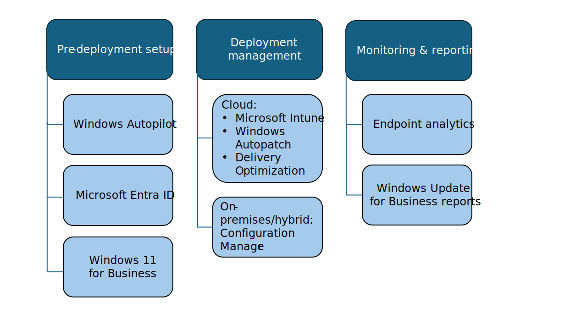

How ready is your infrastructure for Windows 11 deployment? Determine that by following these recommended steps:

| Tasks | Deliverables |
|-------|--------------|
| - Define infrastructure readiness criteria. - Evaluate deployment management tools and infrastructure. - Evaluate current device provisioning processes and tools. - Identify infrastructure gaps. | • Deployment readiness criteria • Infrastructure remediation list • Device provisioning plan • List of infrastructure gaps |

## Define infrastructure readiness criteria

Your infrastructure is ready if it meets the requirements of the Windows 11 feature update. These requirements fall into these categories:

- Management systems (to manage Windows upgrade)
- Provisioning tools (to set up devices)
- Reporting/compliance (to monitor and report on estate health and upgrade status)
- Security measures (to protect the environment)

> [!NOTE]
> ***Recommended deliverable:***
> 
> Are these infrastructure categories enough to describe your readiness criteria? Compare your infrastructure against these requirements and identify what must change to support Windows 11 deployment.

## Evaluate deployment management tools and infrastructure required

Our recommended way forward is cloud-native, which means Microsoft Entra ID-joined and managed by Microsoft Intune. Cloud-native management can largely simplify all steps of your planning, preparation, deployment, and management of Windows 11 with [Microsoft Intune](/mem/intune/fundamentals/what-is-intune) and Windows Autopatch.

Here are some helpful tools that you can use. Which ones do you already have?

Check the prerequisites and plan for the tools that you’ll need to acquire still:

- [**Microsoft Intune:**](/mem/intune/fundamentals/what-is-intune)
  - **Definition & use:** This cloud-based endpoint management solution is designed to simplify management of devices, identities, and apps. It integrates with other Microsoft services and apps ensuring security and advanced management capabilities of hybrid workplaces.
  - **Prerequisites:** Check [supported operating systems and browsers](/mem/intune/fundamentals/supported-devices-browsers) as well as [network configuration requirements and bandwidth](/mem/intune/fundamentals/network-bandwidth-use). If you meet these prerequisites, just sign in to your work or school account and add Intune to your [subscription](/mem/intune/fundamentals/account-sign-up). If you don’t already have an account, you can [sign up for a free trial account](/mem/intune/fundamentals/free-trial-sign-up) to use Intune for your organization.
- [**Microsoft Entra ID:**](/entra/fundamentals/whatis)
  - **Definition & use:** This cloud-based identity and access management service allows people at your organization access external and internal sources securely.
  - **Prerequisites:** You might already have access to Microsoft Entra ID with one of your Microsoft Online business services, such as Microsoft Azure, Microsoft Intune, Microsoft Dynamics 365, or others. If not, [review all available plans](https://www.microsoft.com/security/business/microsoft-entra-pricing) and [licensing options](/entra/fundamentals/licensing).
- [**Windows Autopatch:**](/windows/deployment/windows-autopatch/overview/windows-autopatch-overview?tabs=business-premium-a3-communications)
  - **Definition & use:** This cloud service automates updates for Windows, drivers, Microsoft 365 Apps for enterprise, Microsoft Edge, and Microsoft Teams. It’s designed to improve your organizational security and productivity while simplifying IT management.
  - **Prerequisites:** Check [licensing terms and conditions](/windows/deployment/windows-autopatch/prepare/windows-autopatch-prerequisites?tabs=business-premium-a3-entitlements%2Cbusiness-premium-a3-intune-permissions) for available sets of features. Additionally, you need Microsoft Intune and Microsoft Entra ID with special connectivity, device management, and data and privacy considerations.
- [**Windows Autopilot:**](/autopilot/overview)
  - **Definition & use:** Windows Autopilot is a collection of technologies used to set up and preconfigure new devices, getting them ready for productive use. Additionally, you can use it to reset, repurpose, and recover devices without extensive infrastructure.
  - **Prerequisites:** You need a supported version of Windows General Availability channel to use Windows Autopilot. Extra software, networking, licensing, and configuration [requirements](/autopilot/requirements) apply.
- [**Windows Update for Business reports:**](/windows/deployment/update/wufb-reports-overview)
  - **Definition & use:** This [cloud-based solution](/windows/deployment/update/wufb-reports-overview) provides information about your Microsoft Entra joined devices’ compliance with Windows updates. You can use it to monitor, analyze, and report on compliance issues across your Windows 11 and Windows 10 devices.
  - **Prerequisites:** You’ll need an Azure subscription with Microsoft Entra ID, where devices are Microsoft Entra joined or Microsoft Entra hybrid joined. Check [additional requirements and permissions](/windows/deployment/update/wufb-reports-prerequisites?source=recommendations) you’ll need, including access to endpoints, diagnostic data, and regional coverage.
- [**Endpoint analytics:**](/mem/analytics/overview)
  - **Definition & use:** This collection of scores, baselines, and insights reflects the quality of user experience as your organization undergoes digital transformation.  You can better detect regressions and proactively support your users throughout configuration changes or disruptions due to legacy hardware.
  - **Prerequisites:** Enroll devices via Microsoft Intune or Configuration Manager with a valid Microsoft Intune license. Visit [additional permissions, roles, and access requirements](/mem/analytics/overview) for your scenario.
- [**Windows Hello for Business:**](/windows/security/identity-protection/hello-for-business/)
  - **Definition & use:** This identity protection technology provides security and management capabilities, including device attestation, certificate-based authentication, and conditional access policies. It uses a two-factor authentication method for Microsoft Entra ID and other accounts, combining a device-specific credential with a biometric or PIN gesture.
  - **Prerequisites:** You’ll need one of the following license entitlements: Windows Pro/Pro Education/SE, Windows Enterprise E3/E5, or Windows Education A3/A5. Additionally, review [hardware requirements](/windows/security/identity-protection/hello-for-business/), including biometric sensors.
- [**Microsoft Configuration Manager:**](/mem/configmgr/core/understand/introduction)
  - **Definition & use:** This system management solution, as part of the Microsoft Intune family of products, is designed for on-premises and hybrid environments while integrating with Microsoft cloud. It helps simplify deployment of apps, software updates, and operating systems. You can use it to manage servers, desktops, and laptops, as well as compliance settings, with increased IT productivity.
  - **Prerequisites:** Configuration Manager is included in the following plans: Intune user subscription license (USL), EMS E3/E5, Microsoft 365 E3/E5, and Microsoft 365 F3. You can also get a co-management license to manage devices with Microsoft Intune and Configuration Manager. Check out [additional considerations](/mem/configmgr/core/understand/product-and-licensing-faq).
- [**Delivery Optimization:**](/windows/deployment/do/waas-delivery-optimization)
  - **Definition & use:** This HTTP downloader with a cloud-managed solution allows Windows devices to download update packages from alternate sources. This reduces bandwidth consumption and is done through either a peer-to-peer distribution or [Microsoft Connected Cache](/windows/deployment/do/waas-microsoft-connected-cache).
  - **Prerequisites:** Ensure that devices are on a supported version of Windows and have access to the Internet and Delivery Optimization cloud services. Learn about [Delivery Optimization](/windows/deployment/do/waas-delivery-optimization) and determine the most appropriate [configuration](/windows/deployment/do/delivery-optimization-configure) for your environment.

> [!NOTE]
> ***Recommended deliverable:***
> 
> Create a list of preferred management tools and supporting infrastructure.

## Evaluate current device provisioning processes and tools

Provisioning means configuring devices without imaging. You can easily specify the desired configuration and settings required to enroll the devices into management. For cloud provisioning, we recommend [Windows Autopilot](/autopilot/overview). For on-premises contexts, plan to [use Microsoft Configuration Manager](/mem/configmgr/osd/deploy-use/upgrade-windows-to-the-latest-version).

It’s likely that you have a mixed environment. So, for a quick evaluation of cloud provisioning across your organization, use the “Work from anywhere” report in Endpoint analytics. Get there from [Microsoft Intune admin center](https://go.microsoft.com/fwlink/?linkid=2109431) > Reports > Endpoint analytics > Work from anywhere. Navigate to the [Cloud provisioning](/mem/analytics/work-from-anywhere#bkmk_provisioning) tab to see which Windows 365 Cloud PCs or Intune-managed Windows devices are set to be provisioned via Autopilot. For devices that are enrolled in Endpoint analytics but don’t appear in this list, plan to [register them and create a deployment profile in Windows Autopilot](/autopilot/enrollment-autopilot).

> [!NOTE]
> ***Recommended deliverable:***
> 
> Document your device provisioning plan, including your current processes and tools that work for Windows 11 deployment. Likewise, document any extra provisioning set up you’ll need.

## Identify gaps

Having decided which infrastructure and tools will be required, identify any infrastructure updates that might be needed, or new infrastructure that needs to be commissioned. For example, if you're using Microsoft Configuration Manager to deploy Windows 11, you might need to update it to a later version. Or if you're planning to use Windows Hello for Business for the first time, there are supporting components that you might need to consider, such as infrastructure (or services) to provide certificates.

Do you notice any gaps in infrastructure at this point?

> [!NOTE]
> ***Recommended deliverable:***
> 
> Create an infrastructure readiness report, including gaps and a plan to address or remediate them.

| Tasks | Deliverables |
|-------|--------------|
| - Define infrastructure readiness criteria. - Evaluate deployment management tools and infrastructure. - Evaluate current device provisioning processes and tools. - Identify infrastructure gaps. | • Deployment readiness criteria • Infrastructure remediation list • Device provisioning plan • List of infrastructure gaps |
