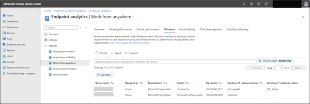

Device readiness requires a few special considerations that are different for Windows 11. It’s because Windows 11 comes with built-in chip-to-cloud security, making it the most secure Windows yet. Here's how you can determine device readiness at your organization:

| Tasks | Deliverables |
|-------|--------------|
| - Define device readiness - Evaluate device eligibility - Evaluate device identity - Identify gaps | - Device readiness criteria - List of eligible and ineligible devices - List of devices by device identity - List of device-related gaps |

## Define device readiness

Device readiness criteria include:

- Device eligibility
- Specific features

You’ll want to consider whether devices have the features that you want to utilize. For example, do you need a camera that can be used for facial recognition with Windows Hello for Business? Other new features of Windows 11 may have more hardware requirements to consider.

> [!NOTE]
> ***Recommended deliverable:***
> 
> Have a shareable list of your device readiness criteria. Do you need readiness criteria for your devices other than eligibility and specific features?

## Evaluate device eligibility

Windows 11 uses the most robust hardware baseline, which informs device eligibility and encourages Zero Trust security.

As you evaluate organizational devices for Windows 11 eligibility, you might end up with three broad lists of devices that are:

- Eligible and ready for deployment
- Eligible but need some remediation (for example, clear drive space)
- Ineligible and need hardware replacement (for example, a new device, an in-place upgrade, etc.)

> [!NOTE]
>
> Most devices purchased in the last 18-24 months will be compatible with Windows 11. Many software publishing partners and original equipment manufacturers (OEMs) already facilitate adding Windows 11 device support into their solutions.

To begin, review the specifications of hardware requirements, OS requirements, feature-specific requirements, and virtual machine support at [Windows 11 requirements](/windows/whats-new/windows-11-requirements).

Alternatively, verify that your devices are eligible and ready using Endpoint Analytics, Microsoft Intune, Windows Update for Business reports, or Windows Autopatch.

### Endpoint analytics

You can use [Endpoint analytics “Work from anywhere”](/mem/analytics/work-from-anywhere) report to help determine the hardware readiness of your devices for Windows 11. This cloud-based service computes your readiness score for all active Intune and Configuration Manager devices [enrolled into Endpoint analytics](/mem/analytics/overview).

Get there from **[Microsoft Intune admin center](https://go.microsoft.com/fwlink/?linkid=2109431) > Reports > Endpoint analytics > Work from anywhere**. Navigate to the **Windows** tab to see and download the list of devices that are capable and not capable of upgrading to Windows 11 based on the minimum system requirements.

(../media/endpoint-expanded.png)

### Microsoft Intune

**[Windows feature update device readiness report](/mem/intune/protect/windows-update-compatibility-reports#use-the-windows-feature-update-device-readiness-report)**. From the [Microsoft Intune admin center](https://go.microsoft.com/fwlink/?linkid=2109431), go to **Reports > Windows updates > Reports > Windows feature update device readiness report**. Select the target OS, scope tags, and other optional settings to generate the report. Examine the report for readiness status of each device along with any issues (system requirements, app compatibility, or driver compatibility risk). Each device includes additional information to help you plan your remediation steps.

### Windows Update for Business reports

**[Feature updates - device status report](/windows/deployment/update/wufb-reports-workbook#feature-updates-tab)**. Use this report to review a summary of how many devices are ready for Windows 11.

### Windows Autopatch device readiness checks

**[Pre- and post-device registration readiness checks](/windows/deployment/windows-autopatch/deploy/windows-autopatch-post-reg-readiness-checks)**. Besides checking for device registration status with Windows Autopatch, see the overall health status of devices. See each device’s Windows OS build, architecture, and build, internet connectivity, required sets of network endpoints, and policies managed by Microsoft Intune or Group Policy Object (GPO).

> [!NOTE]
> ***Recommended deliverable:***
> 
> Document the inventory of your devices that are eligible and ineligible for Windows 11. For devices that require remediations or replacements, document the proposed strategy, updating your PC refresh plan as necessary.

## Evaluate device identity

A [device identity](/graph/api/resources/device) is represented by the device’s object in Microsoft Entra ID or Active Directory. Just like users, each device has an identity that gives administrators information they can use when making access or configuration decisions. Device identities are a prerequisite for scenarios like [device-based Conditional Access policies](/entra/identity/conditional-access/concept-conditional-access-grant) and [Mobile Device Management with the Microsoft Intune family of products](/mem/endpoint-manager-overview). Device identity is a fundamental aspect of modern enterprise security and management, ensuring that only trusted devices can access organizational resources.

Device identities are established by joining or registering a device to an identity provider like Microsoft Entra ID. Embrace joining your newly provisioned Windows devices to Microsoft Entra and hybrid joining your previously provisioned Windows devices to Microsoft Entra. For further details, check out [Skilling snack: Windows Entra joined devices](https://techcommunity.microsoft.com/blog/windows-itpro-blog/skilling-snack-windows-entra-joined-devices/4111391).

You can use the [“Work from anywhere” report in Endpoint analytics](/mem/analytics/work-from-anywhere) to evaluate device identity for your Intune and Configuration Manager devices and identify any devices without an appropriate identity.

Get there from **[Microsoft Intune admin center](https://go.microsoft.com/fwlink/?linkid=2109431) > Reports > Endpoint analytics** and explore the **Cloud identity** tab. Identify devices enrolled and not enrolled into Microsoft Entra ID. For on-premises Active Directory domain-joined devices, plan to hybrid-join them to [Microsoft Entra ID](/entra/identity/devices/how-to-hybrid-join).

> [!NOTE]
> ***Recommended deliverable:***
> 
> Enhance your device inventory files with device identity information. Identify devices that don't yet have an identity and those you’d like to enroll into Microsoft Entra ID.

## Identify gaps

Which of the device-related tasks or deliverables do you still need help with as you plan for Windows 11?

> [!NOTE]
> ***Recommended deliverable:***
> 
> Document any remaining steps and a plan to address them between now and the next preparation stage.

| Tasks | Deliverables |
|-------|--------------|
| - Define device readiness - Evaluate device eligibility - Evaluate device identity - Identify gaps | - Device readiness criteria - List of eligible and ineligible devices - List of devices by device identity - List of device-related gaps |
