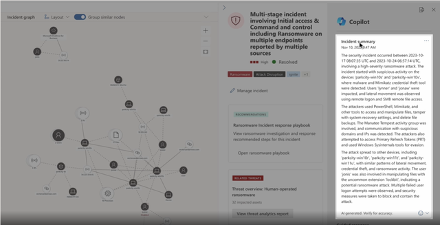

Microsoft Security Copilot is a cutting-edge AI assistant that's deeply integrated with Microsoft’s security ecosystem. It’s designed to help security professionals:

- Investigate incidents using natural language prompts
- Summarize threat intelligence and incident timelines
- Generate reports and recommendations
- Automate repetitive or complex tasks

In education, where IT teams are often stretched thin, Security Copilot acts as a force multiplier. It enables faster decision-making, reduces manual effort, and helps ensure that no critical signals are missed.

Key capabilities include:

- **Natural language queries**: Ask questions like *"What happened with the phishing email yesterday?"* and get a detailed, AI-generated response.
- **Incident summaries**: Quickly understand what happened, who was affected, and what actions were taken.
- **Threat hunting**: Use AI to identify patterns and anomalies across your environment.
- **Report generation**: Create professional summaries for leadership, compliance, or parent communication.

Security Copilot isn't a replacement for human expertise—it’s a partner that enhances your ability to protect your school.

## Requirements
- **Azure subscription**: Before you can use Security Copilot or buy its resources, you must have an Azure account. Think of this as the "membership" you need before you can shop for Security Compute Units (SCUs). 
- **Security Compute Units (SCUs)**: Like "power units" that Security Copilot needs to run smoothly.
- **Capacity**: The "container" in Azure that holds your SCUs. You can manage this in the Azure portal or Security Copilot portal. There’s also a dashboard to monitor usage and adjust as needed.
   - **Provisioned capacity**: You decide how many SCUs you want upfront. These are billed by the hour.
   - **Overage capacity**: Extra SCUs that kick in if you use more than you planned. These are billed based on actual usage. If your workload suddenly increases, you can set an overage limit so extra SCUs are available automatically. Overage can be unlimited or capped at a maximum amount. This helps avoid surprises while keeping billing predictable.

**Why provision SCUs?**

You can adjust SCUs anytime—add more when you expect heavy workloads or reduce them when things are quiet.
No long-term commitment. You pay for what you use.

> [!IMPORTANT]
>
> SCUs for Security Copilot can't be shared with other services like Data Security Investigations. Each service needs its own SCUs.
> Some features in other products also need SCUs, but those SCUs only work for that product—not for Security Copilot.

**Billing basics**

- **Hourly blocks**: If you use SCUs anytime within an hour, you pay for the whole hour. For overage SCUs, billing is more precise.
