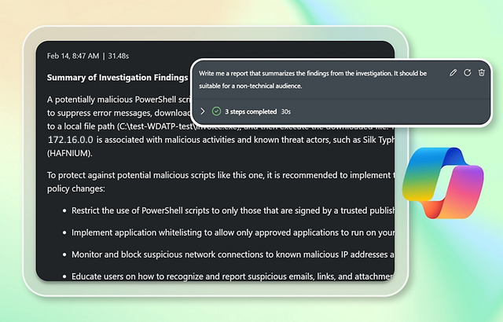

Resolving a security incident is only part of the job. Communicating what happened—and how it was handled—is equally important. School leadership, parents, and regulatory bodies might require documentation.

A well-crafted incident report should:

- Summarize the incident clearly and concisely
- Provide a timeline of events
- Detail affected systems or users
- Outline actions taken and lessons learned
- Recommend steps to prevent recurrence

Creating such reports manually can be time-consuming. Security Copilot simplifies this by generating draft reports based on your investigation. You can customize the language, add school-specific context, and export the report for distribution. This not only saves time but ensures consistency and professionalism in your communications.