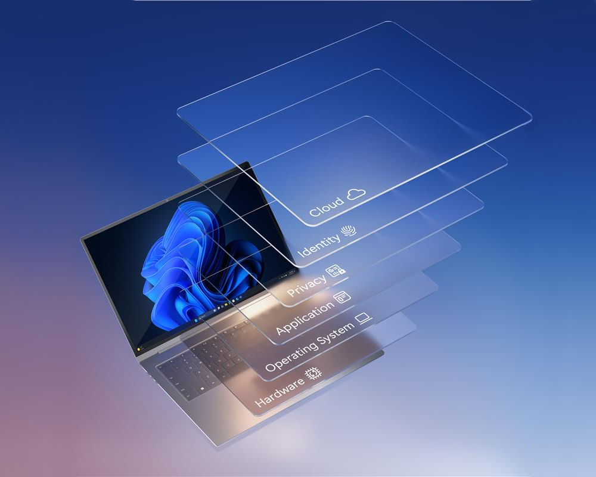

Education institutions must protect sensitive data, support diverse devices, and maintain secure access for students, faculty, and staff—often across multiple locations and networks. Meeting these demands requires more than isolated tools; it requires a connected, end-to-end approach.

Microsoft provides an integrated security and management ecosystem designed to help institutions address these challenges. This approach is built on three key concepts: Zero Trust, chip-to-cloud security, and unified protection.

## Zero Trust security model

Zero Trust is a security model based on the principle that no user or device should be implicitly trusted—even if they appear to be inside the institution’s network perimeter. Instead, every access request is continuously evaluated using signals such as identity, device health, location, behavior, and risk.

This approach is especially important in education, where students, faculty, and staff frequently access systems from a wide range of devices and networks.

The Zero Trust model is built on three core principles:

| Principle                | Description                                                                 |
|-------------------------|-----------------------------------------------------------------------------|
| Verify explicitly       | Always authenticate and authorize based on all available data points.      |
| Use least privilege access | Limit user access with Just-In-Time and Just-Enough-Access (JIT/JEA), risk-based adaptive policies, and data protection. |
| Assume breach           | Minimize blast radius and segment access. Verify end-to-end encryption and use analytics to get visibility, drive threat detection, and improve defenses. |

For example, a student logging in from home on a shared device, a professor accessing research systems while traveling, or a staff member using a personal device might each introduce different levels of risk. Zero Trust addresses these scenarios through conditional access policies that adapt in real time.

By enforcing explicit verification, limiting access to only what is necessary, and operating under the assumption that a breach has occurred, Zero Trust helps institutions reduce unauthorized access and prevent lateral movement across networks.

## Chip-to-cloud security

Chip‑to‑cloud security extends this protection by integrating security into every layer of Microsoft’s platform—from the hardware that powers devices to the cloud intelligence that detects emerging threats. Hardware‑rooted protections such as Secure Boot, virtualization‑based security, and trusted platform modules help ensure that devices start securely and remain protected against tampering.

Operating system‑level protections enforce secure configurations and isolate sensitive processes. Cloud‑based analytics provide intelligence derived from billions of global signals, enabling advanced detection of threats that might not yet be widely known. When institutions rely on a combination of managed devices and cloud‑based security services, they create a consistent baseline of protection that persists no matter where learning takes place.

## Unified protection

Rather than relying on disconnected tools from multiple vendors, education institutions can adopt an integrated approach that brings identity, device, application, data, and threat protection together in one ecosystem.

Microsoft delivers this unified protection through a set of solutions that work together to secure users, devices, and data across the environment. Each solution plays a specific role, but their value is greatest when used as part of an integrated system.

| Microsoft solution | What it does |
|--------------------|--------------|
| Microsoft Defender for Endpoint | Protects endpoints from malware, ransomware, and advanced persistent threats. |
| Microsoft Entra ID | Authenticates users and applies conditional access policies to control access to resources. |
| Microsoft Intune for Education | Provides device configuration, app deployment, and policy enforcement through a centralized, cloud-based dashboard. |
| Microsoft Priva | Helps organizations manage personal data and privacy risk and supports compliance with privacy regulations. |
| Microsoft Purview | Provides data governance, classification, and compliance capabilities across the organization. |
| Microsoft Sentinel | Analyzes signals across the organization, correlating data from logs, devices, apps, and networks to detect anomalies. |

Together, these solutions create a unified security foundation that is more effective than individual tools used in isolation. By using this integrated education ecosystem, institutions can strengthen security, simplify management, and support safe, uninterrupted learning experiences.
