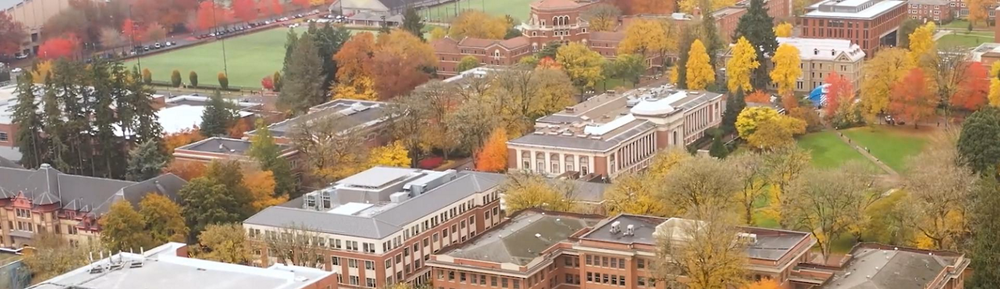

Imagine you're the lead IT administrator for a large university with tens of thousands of students, faculty, and staff. This higher education institution relies on complex digital systems to support learning, research, and administrative operations, and must maintain security and compliance across the board.

- Your university faces the constant risk of cybersecurity incidents that could disrupt research, teaching, or student services.
- IT and security teams are limited and must respond quickly to emerging threats.
- Systems and data are distributed across endpoints, networks, servers, and cloud applications.
- The institution must balance open collaboration with strong protection of sensitive data.

Think about what we’ve covered so far and ask yourself:

- How would you detect and respond to threats quickly across such a large and complex environment?
- Which tools could provide unified visibility and centralized incident response?
- How would you protect endpoints, identities, and sensitive data while enabling collaboration?
- How might AI and automation help your security team work more efficiently and reduce manual workloads?

Reflecting on these questions helps you consider how modern security solutions can increase resilience and improve operational efficiency at higher education institutions.

> [!TIP]
>
> Before reading the real-world example, take a moment to imagine your own approach. Consider which Microsoft solutions you might deploy first, how you would coordinate your IT team, and what processes or automations could help you respond faster. How would you ensure research and academic work could continue safely during an incident?

Now, let’s look at a real-world example of a higher education institution that faced a similar challenge.

## Customer scenario: Oregon State University (Higher Education)

[Oregon State University (OSU)](https://www.microsoft.com/customers/story/1747330384796486050-oregon-state-university-microsoft-security-copilot-higher-education-en-united-states?msockid=2d94348f3bec6ddc210a22003fec6b91) serves 38,000 students and operates a significant research environment. The university faced a complex cybersecurity incident that required its first full-scale incident response effort. The speed and complexity of the incident placed unprecedented demands on their IT team, who relied on manual investigation and fragmented tools.

This situation exposed several gaps in OSU’s security operations. The university had limited visibility across systems and lacked coordinated threat response mechanisms. At the same time, OSU needed to maintain an environment that supported open research collaboration, without compromising compliance or security.

To address these challenges, OSU established a Security Operations Center and implemented Microsoft Sentinel as its central platform for visibility and incident monitoring. Microsoft Sentinel consolidated logs, correlated threat signals, and helped identify suspicious behaviors quickly. Microsoft Defender provided endpoint protection across the institution, enabling coordinated responses to device-level threats. Microsoft Entra ID allowed the team to investigate unusual sign-in activity and enforce stronger identity protections. Additionally, Microsoft Security Copilot introduced AI-assisted support that helped their security analysts work more efficiently, generate incident summaries, and reduce time spent on manual analysis.

As a result of this modernization effort, OSU reduced incident detection time from weeks to minutes. Daily open incidents dropped from thousands to approximately 30, reflecting both the efficiency and accuracy of Microsoft’s security tools. The institution achieved five years’ worth of security progress in just two years, strengthening its ability to safeguard sensitive research and academic systems.

This example illustrates how Microsoft's security ecosystem can transform institutional resilience, streamline operations, and improve the ability to respond to threats while supporting collaboration and innovation.

> [!TIP]
>
> Compare this scenario to the challenges we discussed earlier and consider how OSU used Microsoft security solutions to detect, investigate, and respond to threats more efficiently.
>
> Reflect on how similar strategies—such as centralized monitoring, endpoint protection, identity management, and AI-assisted analysis—could be applied in your own education institution to enhance security, operational efficiency, and resilience.
