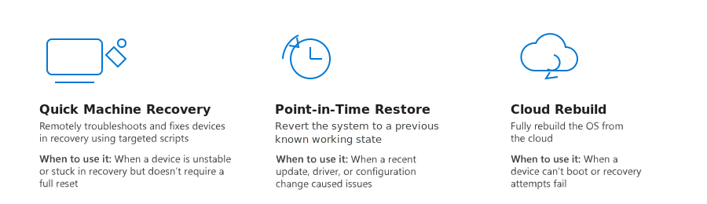
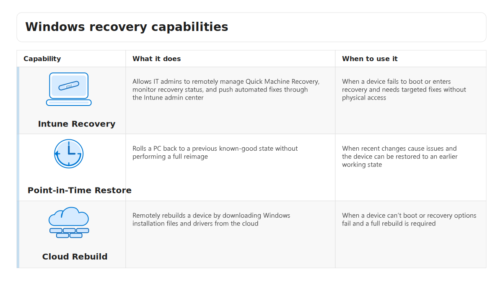

Managing devices at scale requires tools that simplify provisioning, updates, and recovery. Windows 11 Pro integrates with Microsoft Intune and other services to streamline these tasks.

## Windows Resiliency Initiative

The Windows Resiliency Initiative is a Microsoft initiative dedicated to strengthening enterprise resilience with Windows. Key objectives include creating new recovery capabilities to ensure business continuity, such as:

**Key features:**

- **Quick Machine Recovery**: Automates remediation when a PC fails to boot by applying targeted fixes and restoring functionality. Quick Machine Recovery can be managed through Microsoft Intune.
- **Run security apps outside kernel mode**: Isolates critical security processes from the operating system kernel to prevent malware from tampering with them. Isolation of security apps is enabled by default on supported hardware.
- **Modernized recovery capabilities**: Includes cloud-based options for rebuilding devices and rolling back to previous states, reducing the need for full reimaging. Cloud-based recovery options require Intune integration and proper policy configuration.

**When to use it:**
Ideal for organizations managing large fleets of devices where downtime impacts productivity, especially in hybrid work environments where IT can't physically access every device

**Example use-case:**  
A global enterprise experiences a widespread boot failure after a critical update. Using Quick Machine Recovery and Intune, IT administrators remotely trigger automated fixes and restore devices without requiring employees to return hardware to the office.

## Microsoft Intune integration

[Microsoft Intune](/mem/intune/fundamentals/what-is-intune) is a cloud-based endpoint management solution that provides centralized control over Windows devices. It enables IT administrators to configure security policies, deploy applications, and manage updates across large device fleets—all from a single console. Microsoft Intune integration with Windows 11 Pro enhances resilience by adding advanced recovery and rebuild capabilities.

**Key features:**

- **Intune Recovery:** Allows IT admins to manage Quick Machine Recovery remotely. This means administrators can trigger automated fixes for devices that fail to boot without requiring physical access. IT admins can monitor recovery status and push scripts through the Intune admin center.
- **Point-in-Time Restore:** Rolls back a PC to a previous state without performing a full reimage. This feature saves time and reduces disruption by restoring the system to a known good configuration. Point-in-Time Restore and Intune Recovery require Intune enrollment and proper policy configuration.
- **Cloud Rebuild:** Enables IT teams to rebuild devices remotely—even if they can't boot. The device downloads installation files and drivers from the cloud, then reinstalls Windows to start fresh. Cloud Rebuild requires network connectivity and access to cloud-based installation files.

**When to use it:**  
These features are ideal for organizations with distributed workforces or remote employees where physical access to devices is limited. They help maintain productivity and reduce downtime during incidents such as failed updates or malware infections.

**Example use-case:**  
A global enterprise experiences a critical update failure affecting hundreds of remote laptops. Using Intune Recovery and Cloud Rebuild, IT administrators remotely restore functionality without shipping devices back to headquarters.

## Automated updates

Automated updates in Windows 11 Pro ensure that devices remain secure and compliant by applying patches and feature updates without requiring manual intervention. Keeping systems patched is essential to protect against vulnerabilities and maintain operational stability. Windows provides two key capabilities for automating updates: Windows Autopatch and Windows Hotpatch.

- **[Windows Autopatch](/windows/deployment/windows-autopatch):** Automates the deployment of monthly security updates and quality patches across the organization. Autopatch uses update rings and phased rollouts to minimize risk and disruption. Windows Autopatch can be enabled through Microsoft 365 Business Premium or Enterprise subscriptions. IT admins configure update rings and policies in the Microsoft Endpoint Manager admin center.
- **[Windows Hotpatch](/windows/deployment/windows-autopatch/manage/windows-autopatch-hotpatch-updates):** Applies critical security updates while requiring fewer reboots. This reduces downtime and helps maintain productivity by patching running code in memory while the system remains operational. Windows Hotpatch integrates with Windows Update and honors existing update ring configurations. It requires supported hardware and operating system versions.

**When to use it:**  
These features are ideal for organizations that need to maintain high availability and minimize interruptions during update cycles. Hotpatch is particularly useful for devices running mission-critical workloads where rebooting is disruptive.

**Example use-case:**  
A financial institution uses Windows Autopatch to ensure all endpoints receive security updates automatically. For its trading systems, which can't afford downtime, the organization enables Windows Hotpatch to apply patches without rebooting, maintaining compliance, and uptime.

## AI-assisted management

AI-assisted management in Windows uses Microsoft Security Copilot integrated with Microsoft Intune to help IT teams respond to incidents faster and manage threats more effectively. Security Copilot uses conversational AI to interpret queries, analyze data, and provide actionable recommendations.

**Key capabilities:**

- **Incident response:** Quickly identify and remediate security issues using natural language queries.
- **Threat hunting:** Search for indicators of compromise across endpoints without writing complex queries.
- **Intelligence gathering:** Summarize alerts and generate reports to support decision-making

Security Copilot requires integration with Microsoft Intune and appropriate licensing. IT admins can access Copilot through the Intune admin center and use conversational prompts to perform tasks.

**When to use it:**  
Ideal for organizations that need to accelerate security operations and reduce manual effort in analyzing alerts and responding to threats.

**Example use-case:**  
An IT security team receives multiple alerts about suspicious activity. Instead of manually reviewing logs, they use Security Copilot to summarize alerts, identify affected devices, and recommend remediation steps—all through a simple conversational interface.

## Agents in Windows

Windows introduces AI agents that can automate tasks and workflows directly within the operating system. These agents are AI-driven components that perform tasks autonomously or with minimal user input, helping streamline everyday work by handling common or repetitive actions, such as:

- Summarizing documents
- Automating routine processes
- Supporting decision-making within workflows

Agents integrate with Microsoft 365, the Windows shell, and other AI features such as Microsoft 365 Copilot to provide intelligent assistance across Windows. They extend automation capabilities while operating within established management and security boundaries, allowing organizations to adopt AI-powered workflows without losing control.

**Governance and security controls**

To support secure and responsible AI adoption, agents in Windows include built-in governance and security controls. IT administrators can:

- Configure guardrails using Microsoft Intune and the Microsoft 365 admin center.
- Use Agent ID to clearly distinguish agent actions from user actions.
- Apply compliance and data protection policies to sensitive workflows.
- Audit agent activity to maintain visibility and traceability.

Governance ensures that agents operate within enterprise policies, preventing unauthorized actions and maintaining compliance with regulatory requirements.

**Example use-case:**

An organization uses agents to automate document summarization for internal reports while enforcing data loss prevention (DLP) policies through Intune. Audit logs provide traceability for every agent action, supporting compliance and security reviews.

### Managing agents at scale

IT teams can manage agents using familiar tools and processes, helping reduce operational complexity while enabling AI adoption. Management capabilities include:

- Centralized visibility into agent activity
- The ability to adjust or revoke permissions as needed
- Consistent policy enforcement across devices and users

By combining automation with enterprise-grade governance, agents in Windows help organizations adopt AI safely and responsibly—improving efficiency while maintaining security and compliance.
