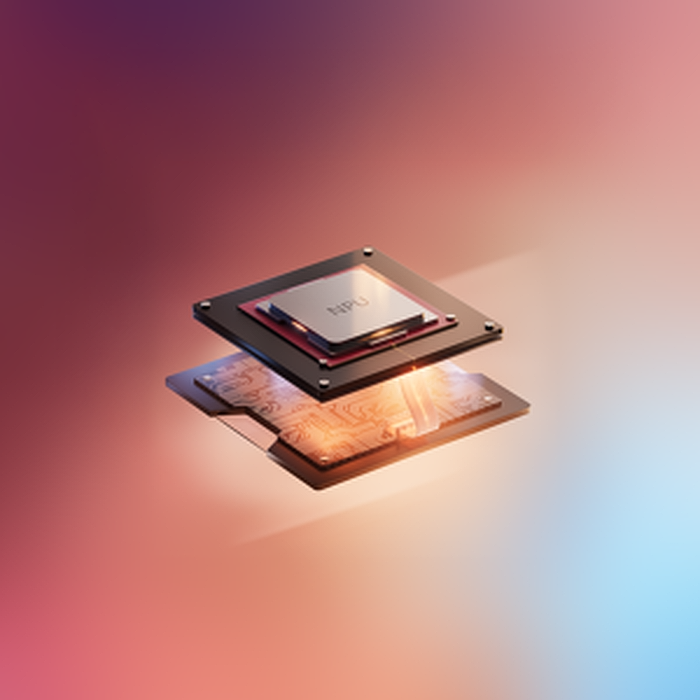

A Copilot+ PC is a high-performance computing device designed to support advanced AI-driven workflows. These systems are equipped with specialized hardware to enable efficient processing of AI tasks.

## Key Features

- Integrated silicon architecture comprising CPU, GPU, and NPU, delivering up to 45 TOPS (Trillions of Operations Per Second).
- Includes Microsoft Copilot for AI-assisted productivity.
- Dedicated Copilot key integrated into the keyboard for quick access to AI features.

## Key terms

- The Central Processing Unit (CPU) is the brain of the computer, responsible for performing basic operations.
- The Graphics Processing Unit (GPU) specifically specializes in rendering images and videos, both in 2D and in 3D.
- The Neural Processing Unit (NPU) is a specialized chip used to run AI processes directly on hardware, with specific architecture for deep learning.
- Trillions of Operations Per Second (TOPS) is a unit that measures the total maximum achievable throughput for an NPU.

