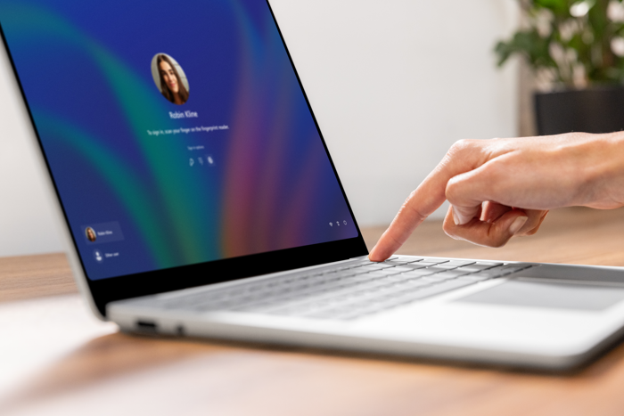
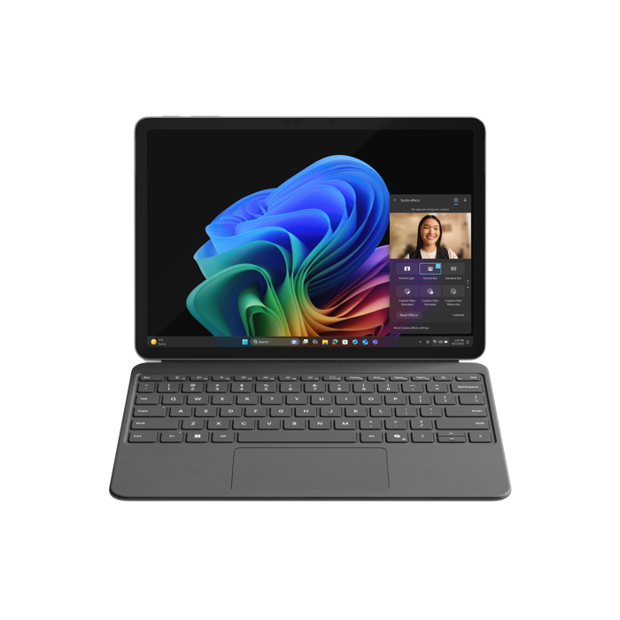

Microsoft Surface Pro is classified as a Copilot+ PC, integrating AI-driven capabilities designed to enhance productivity, streamline problem-solving, and support emerging business use cases. Copilot+ PCs incorporate intelligent edge computing to improve desktop performance. The Microsoft Surface Pro is engineered to support secure AI operations and deliver high-performance computing suitable for organizations of varying sizes.

By utilizing Copilot+ PCs such as the Microsoft Surface Pro, organizations can accelerate innovation and improve operational efficiency. These devices are optimized to support demanding workloads and enable faster access to information, improved responsiveness, and enhanced data protection through on-device AI processing. People adopting Copilot+ PCs are positioned to adapt to ongoing AI advancements. Feature updates, including the latest AI enhancements in Windows, are delivered directly to supported devices, ensuring continued alignment with evolving technology standards.

## Cloud protection

- Microsoft Defender for Endpoint (Software license required. Sold separately.)
- Window Update
- Conditional Access
- Surface Management Portal (Software license required. Sold separately. Unique to Surface.)
- Mobile Device Management (MDM) Unified Extensible Firmware Interface (UEFI) Management (Software license required. Sold separately.)

## OS protection

- Advanced Windows Security Features like Hypervisor-Enforced Code Integrity/Virtualization-Based Security (HVCI/VBS)
- Secure Boot enabled by default
- Microsoft Defender Antivirus
- BitLocker
- Secured Core PC on most devices
- Firmware Assisted System Resume (FASR) on Intel devices

## Firmware protection

- Microsoft UEFI (Unique to Surface.)
- Surface Enterprise Management Mode (SEMM) (Unique to Surface.)
- Device Firmware Configuration Interface (DFCI)
- Microsoft Intune (Software license required. Sold separately.)

## Hardware protection

- Windows Hello
- Trusted Platform Module 2.0
- Pluton technology with Microsoft SQ3 processor
- Removable Solid State Drive (SSD)

## Get more done with less effort

Use AI-powered features such as Recall (preview) to locate specific information efficiently. Available actions include copying content, summarizing text, initiating Copilot queries, translating text, or composing an email directly from the interface.

### Creative tools and studio effects

Studio Effects enables users to generate artwork using text and drawing prompts. These tools support creative expression through AI-assisted rendering and visual enhancements.

### Video call enhancements

Windows Studio Effects improves video call quality across applications. Features include portrait lighting, visual filters, and automatic eye contact correction. These settings are accessible via Quick Settings.

### Communication support

Live Translate enables real-time translation of spoken content, supporting up to 44 languages translated into English. This feature enhances comprehension across calls, conversations, and recordings.

### Writing assistance

Copilot supports drafting and editing of emails and other written content. It provides revision suggestions and operates within a secure environment protected by commercial data safeguards.

### A quick dive into Recall (preview)

Recall enables users to locate previously viewed or heard content on their device using typed, spoken, or written input. Based on contextual cues, Recall provides suggestions to facilitate task continuation.

For example, users can retrieve a document by describing content they remember. Recall then offers actionable suggestions to proceed with related tasks.