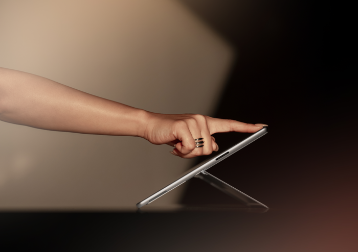
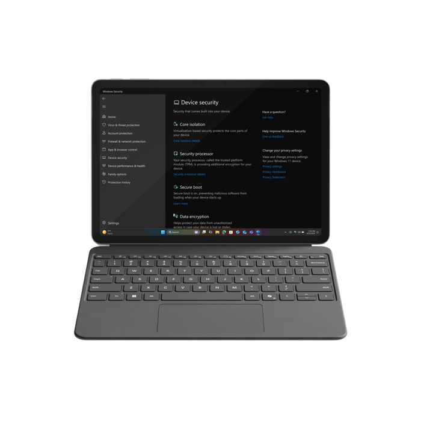

Recall operates entirely on-device; user data isn't transmitted externally. Users maintain full control over data sharing preferences.

Memory Capture can be paused at any time. Additionally, users can configure settings to block specific applications and websites from being captured. Content accessed via InPrivate browsing in Microsoft Edge is automatically excluded from Memory Capture.

## Enhanced performance and productivity

Surface Pro is equipped with the Snapdragon X Series Platform processor, which supports advanced AI capabilities designed to improve computing efficiency, speed, and power management.

### Performance metrics

The following performance benchmarks highlight the device's capabilities:

- CPU performance is up to 90% faster compared to Surface Pro 9.
- Compute speeds exceed the compute speeds of the MacBook Air M3.
- Neural Processing Unit (NPU) performance is up to 2× faster than that of MacBook Air and MacBook Pro.

### Battery life and power efficiency

Surface Pro is designed to meet the demands of mobile professionals with extended battery life and efficient power usage:

- Provides up to 14 hours of battery life for mobile use cases.
- Supports fast charging with a minimum 65 W power supply via Surface Connect or USB-C®.

## Unlock true flexibility

Microsoft Surface Pro is designed to deliver high performance within a versatile form factor.

The device includes a 165-degree kickstand, allowing adjustable positioning for various use cases. It also introduces the Surface Pro Flex Keyboard, which supports both attached and detached configurations, enhancing adaptability for different workflows.  

The Surface Pro Flex Keyboard enables users to transition between setups throughout the day. It can be paired with the Surface Pro for a traditional laptop configuration or used independently for increased flexibility.  

When docked to an external monitor, the detached keyboard provides a more ergonomic workspace. Users can operate the keyboard with one hand while using a pen with the other, supporting creative tasks in constrained environments such as airplane seating.

Additionally, the Kensington Elevated Stand is available for Surface Pro, offering improved ergonomics and workspace organization.

Check out [this link to learn more](https://aka.ms/elevatedstand)

### Be productive anywhere

Surface Pro is designed to support mobile productivity through flexible connectivity options. The device offers high-speed performance with support for optional 5G and Wi-Fi 7.  

Optional 5G connectivity enables access to cellular networks in environments where Wi-Fi is unavailable. Wi-Fi 7 provides enhanced wireless performance, offering faster data transfer rates and improved bandwidth efficiency, which supports stable video conferencing and other real-time applications.

These connectivity features allow you to maintain productivity across various work environments.

## Better image for better work

Surface Pro offers display options including Organic Light Emitting Diode (OLED) and High Dynamic Range (HDR), which enhance peak brightness for improved visibility in both daytime and nighttime environments.

- Increased pixel density enables finer image detail, supported by a million-to-one contrast ratio.
- HDR technology expands brightness and contrast range, producing brighter whites, deeper blacks, and a broader color spectrum.
- Adaptive color support improves color accuracy based on ambient lighting conditions.
- Compatible with up to three external 4K displays at 60 Hz.

## Best in class security

Microsoft Surface Pro with the Microsoft Pluton security processor is a Secured-core PC for the highest level of Windows PC protection. With Windows 11 and Windows Hello Enhanced Sign-in Security (ESS), Surface Pro provides unparalleled biometrics security you can trust.

Microsoft Surface Pro gives customers more ways to securely sign in and authenticate.

For example, they can sign in instantly and securely without a password using a Near-Field Communication (NFC) badge or Windows Hello with facial recognition.

- Chip-to-cloud security ensures devices are protected.
- Interface supports secure zero-touch provisioning.
- Windows 11 Pro is designed with layers of security enabled by default.

