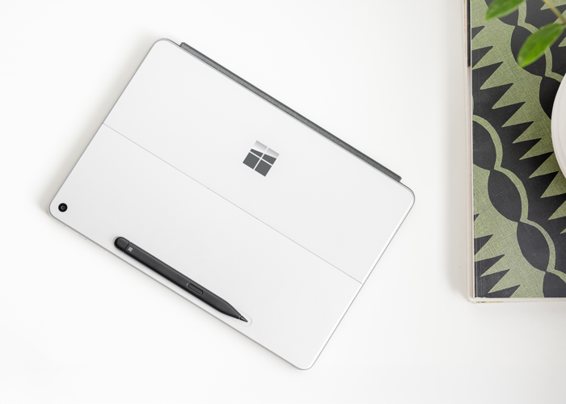

Surface Pro is designed to support seamless operation of critical line-of-business (LOB) applications. Microsoft is committed to ensuring that essential software is compatible and optimized for the latest device and operating system versions. If compatibility issues arise, Microsoft offers support through the App Assure program, where engineers help resolve issues at no extra cost.  

IT professionals can deploy and manage Surface Pro devices using modern tools:

- **Windows Autopilot** simplifies device provisioning through cloud-based deployment, reducing IT overhead.  
- **Surface IT Toolkit** enables administrators to perform tasks such as troubleshooting, hardware lockdown, secure data erasure, and digital asset tagging—all within a single application.  
- **Surface Management Portal** provides centralized access for IT teams to manage warranties, perform diagnostics, and monitor Surface devices and accessories.
- **5G eSIM Management via Microsoft Intune** allows IT teams to deploy and manage cellular connectivity without physical SIM cards, streamlining security and administration.

## Our most advanced pen

Surface Pro supports advanced pen input for tasks such as note-taking, markup, virtual collaboration, and design work. The pen includes haptic feedback to simulate a more natural writing experience. AI-enhanced tools are integrated to support productivity and collaboration workflows. Users can use AI features to assist with tasks such as autocompleting sketches or summarizing handwritten notes in OneNote.

## AI-enhanced Studio Camera

The Surface Studio Camera integrates with AI-powered Windows Studio Effects to enhance video quality and user framing. The Neural Processing Unit (NPU) supports these capabilities.

### Key features

- Automatic framing: Uses AI to dynamically adjust the camera view to keep participants centered within the frame.
- Optimized for various environments including office, home, and conference rooms to maintain consistent visual presentation.

## Richer experiences

The device includes an ultra-wide field of view Quad HD front-facing camera, designed to provide expanded visual coverage during video conferencing.

The 10.5MP Ultra HD rear-facing camera enables users to securely capture and edit images directly on the Microsoft Surface Pro. This functionality supports tasks such as photographing whiteboard notes, scanning documents, and capturing site-specific visuals.

Portrait Light is a newly introduced feature that adjusts lighting conditions to improve visual clarity in low-light environments, such as dim offices or stage settings. Additionally, Windows Studio Effects are powered by the Neural Processing Unit (NPU), enabling AI-enhanced video conferencing with optimized performance and minimal effect on system resources.

## Surface and sustainability

Surface products are designed with principles of the circular economy, incorporating sustainability into product development and lifecycle management:

- Computer enclosures are manufactured using 100% post-industrial recycled aluminum.
- Packaging and energy efficiency are improved compared to Surface Pro 9.
- Devices are designed for serviceability, featuring replaceable components and service options intended to extend product lifespan and support return on investment.

## Designed for everyone

Surface Pro, when paired with the Surface Pro Flex Keyboard, offers inclusive design features that support a wide range of user needs:

- The precision haptic touchpad enables interaction using various parts of the body, including the palm, foot, edges of the hand, and residual limbs.
- Haptic settings can be enabled via the Surface app using a toggle switch.
- The Surface Pro Flex Keyboard allows for ergonomic positioning by enabling the keyboard to be used separately from the device.
- A bold keyset version of the Surface Pro Keyboard and Surface Pro Flex Keyboard is available, featuring large, high-contrast font for improved visibility and ease of typing.
- Surface Pro supports various accessories to help users create a personalized and accessible workspace.
- The integrated kickstand allows for adjustable viewing angles, accommodating diverse workspace configurations.
- The device can be used in tablet mode with touch or pen input, which may be more accessible for users who prefer alternatives to a keyboard or mouse.
- High-quality microphones support voice dictation, and the multi-touch screen with digital ink enables tactile and natural interaction.

Microsoft Surface supports accessibility through compatible tools and accessories. For more information, [visit here](https://support.microsoft.com/adaptiveaccessories).