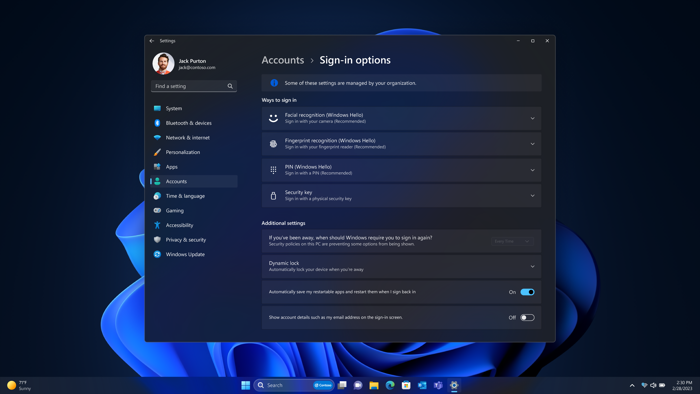

## Gain granular control across endpoints and AI

Safeguard your business and easily enforce security policies across all your endpoints including PCs, apps, and new AI tools. 

- Config refresh15
- Intune Endpoint Privilege Management16
- Microsoft vulnerable driver blocklist
- Windows app control for business
- Windows administrator protection (enhanced) 

:::image type="content" border="true" source="..\media\shield-identities.png" alt-text="An illustration of visual elements that depict identity shielding or protection such as a shield, a fingerprint icon, and a masked password.":::

## Shield identities anywhere

Defend against cyberthreats with the latest credential safeguards for better peace of mind, including biometric sign-in with Windows Hello for Business.17

- Enhanced phishing protection 
- Lock it and leave it17
- Passkeys
- Token protection for secure sign-in sessions (enhanced)18
- Windows Hello for Business
- Windows Local Administration Password Solution (LAPS) with Microsoft Entra ID 

## Lock it and leave it

To help protect your data and privacy, your PC signs you in with Windows Hello and works with presence sensing to lock when you step away. Your PC can also adaptively dim if someone else is detected looking at your display.17

## Windows Hello for Business

To protect against credential loss or theft, Windows Hello and Windows Hello for Business enable you to securely sign into your device with your face, fingerprint, or PIN instead of a password. 

Windows Hello for Business now enables IT admins to enforce passwordless authentication by removing the password sign-in option on devices. Additionally, Windows Hello has a new look and integration with multiple features including passkeys to provide a more secure, seamless experience.17

## Powerful safeguards for data and privacy

Protect valuable business and personal information from chip to cloud with powerful hardware-baked security by default, enhanced privacy settings, and granular IT controls including Microsoft Copilot6 with enterprise data protection. 

- Device attestation with Intune19
- Enhanced privacy settings
- Integrated hardware-backed security
- Microsoft Copilot with enterprise data protection

## Disclaimers

1. Sold separately.  
1. Results in comparison to Windows 10 PCs. *Improve Your Day‑to‑Day Experience with Windows 11 Pro Laptops*, Principled Technologies, April 2023. Report commissioned by Microsoft.  
1. Results in comparison to Windows 10 PCs. Microsoft commissioned study delivered by Forrester Consulting *The Total Economic Impact™ of Windows 11 Pro Devices*, December 2022. [https://query.prod.cms.rt.microsoft.com/cms/api/am/binary/RE4Vrvx](https://query.prod.cms.rt.microsoft.com/cms/api/am/binary/RE4Vrvx)  
[!NOTE]
Quantified benefits reflect results over a three‑year period combined into a single composite organization. This organization generates USD 1 billion in annual revenue, employs 2,000 people, refreshes its hardware on a four‑year cycle, and migrates its entire workforce to Windows 11 devices. 
1. Windows 11 Survey Report, Techaisle, September 2024. Microsoft commissioned report where results are in comparison with Windows 10 devices.  
1. Battery life varies based on settings, usage, device, and other factors.  
1. Requires eligible Microsoft 365 license.  
1. Microsoft Entra ID required.  
1. Per user license sold separately; also requires eligible Microsoft 365 plan.  
1. Windows 365 sold separately.  
1. Copilot key is available on many new Windows 11 PCs. Copilot key feature availability varies by market. [Learn more about Copilot key](https://support.microsoft.com/windows/keyboard-shortcuts-in-windows-dcc61a57-8ff0-cffe-9796-cb9706c75eec#WindowsVersion=Windows_11&windowsversion=windows_11).  
1. Windows Studio Effects (background blur, eye contact, voice focus, and automatic framing) are hardware dependent and require a qualified Neural Processing Unit (NPU).  
1. Live Captions available in many languages. [Learn more about Live Captions](https://support.microsoft.com/windows/use-live-captions-to-better-understand-audio-b52da59c-14b8-4031-aeeb-f6a47e6055df#bkmk_faq_translate).  
1. Natural voices available worldwide in English (US, UK, India), Chinese, Spanish, Japanese, French, Portuguese, German, and Korean. Narrator is available worldwide and supported in these languages: [Appendix A: Supported languages and voices (microsoft.com)](https://support.microsoft.com/windows/appendix-a-supported-languages-and-voices-4486e345-7730-53da-fcfe-55cc64300f01#WindowsVersion=Windows_11).  
1. Hardware dependent. English language only.  
1. Microsoft Intune or other cloud device management solution required; sold separately.  
1. Microsoft Intune and Microsoft Entra ID required; sold separately.  
1. Hardware dependent.  
1. Developer enablement required. Windows 11 E3/E5 required.  
1. Requires Microsoft Intune or other modern device management service; sold separately.  
1. Requires Microsoft 365 along with tenant and per user licensing.  
1. Windows 11 Enterprise E3 or E5 required.  
1. Supports English (US, GB, AU, CA, IN), Spanish (Spain, Mexico), Japanese, French (France, Canada), German, Portuguese (Brazil), Italian, Korean, and Chinese (Simplified).  
1. Bluetooth required; iPhone only with iOS14 or later required; Link to Windows app available in the Apple App Store. iOS doesn't support group messaging and multimedia file sharing in messaging.  
1. Requires internet connection and online availability of electrical grid data.
