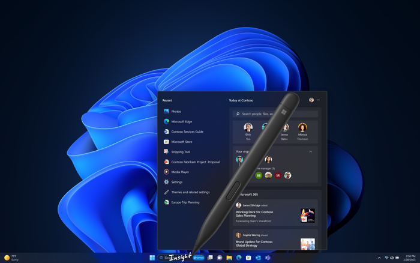

## Perform like a pro

With the latest Windows 11 Pro devices, you can work effectively from anywhere—with speed, flexibility, and style. Many are optimized for AI with built-in Neural Processing Units (NPUs) for enhanced performance.

- High-quality camera, mic, and display
- NPU on select devices
- Enhanced digital ink, touch, voice 
- Supports multiple 4K monitors

## Windows Ink

Digital handwriting smoothly converts to typed text and supports multiple languages. Inking also works across more apps, including Windows Notifications, Photos, Paint, Paint 3D, Clipchamp, and non-Microsoft apps like Zoom, Spotify, WhatsApp, Facebook Messenger, and Good Notes.22

## Personalize for every workstyle

There’s a Windows PC for every preference and workstyle, from sleek 2-in-1 devices to powerful desktops—all compatible with many leading applications and accessories.

- Bluetooth Low Energy (LE) Audio support17
- Microsoft Phone Link (enhanced)23
- Supports multiple 4K monitors
- High-quality camera, mic, and display

## Microsoft Phone Link (enhanced)

Microsoft Phone Link syncs your Android™ phone or iPhone® to your PC so you can access your calls, messages, and more from Windows. Now it’s even easier to sync your mobile device with a new entry point to Phone Link in the Windows Start menu. 

Experience effortless access to your mobile device content and apps, including text, messages, and calls—so you never miss an important update. Pick up where you left off with the latest activities from your phone, seamlessly integrated into your Start menu experience.23

:::image type="content" border="true" source="..\media\phone.png" alt-text="A screenshot of a Windows 11 Pro device showing Phone Link with an Android phone connected, displaying call history and notifications.":::

## Work sustainably, unplug longer

Windows 11 Pro devices support more sustainable workstyles. Enjoy the freedom of all day battery life5 plus smart update and recommendations that help reduce your carbon footprint and save energy.

- Windows carbon aware updates24
- Energy saving recommendations in system settings 

## Disclaimers

1. Sold separately.  
1. Results in comparison to Windows 10 PCs. *Improve Your Day‑to‑Day Experience with Windows 11 Pro Laptops*, Principled Technologies, April 2023. Report commissioned by Microsoft.
1. Results in comparison to Windows 10 PCs. Microsoft commissioned study delivered by Forrester Consulting *The Total Economic Impact™ of Windows 11 Pro Devices*, December 2022. [https://query.prod.cms.rt.microsoft.com/cms/api/am/binary/RE4Vrvx](https://query.prod.cms.rt.microsoft.com/cms/api/am/binary/RE4Vrvx)  
> [!NOTE]
> Quantified benefits reflect results over a three‑year period combined into a single composite organization. This organization generates USD 1 billion in annual revenue, employs 2,000 people, refreshes its hardware on a four‑year cycle, and migrates its entire workforce to Windows 11 devices.
1. Windows 11 Survey Report, Techaisle, September 2024. Microsoft commissioned report where results are in comparison with Windows 10 devices.  
1. Battery life varies based on settings, usage, device, and other factors.  
1. Requires eligible Microsoft 365 license.  
1. Microsoft Entra ID required.  
1. Per user license sold separately; also requires eligible Microsoft 365 plan.  
1. Windows 365 sold separately.  
1. Copilot key is available on many new Windows 11 PCs. Copilot key feature availability varies by market. [Learn more about Copilot key](https://support.microsoft.com/windows/keyboard-shortcuts-in-windows-dcc61a57-8ff0-cffe-9796-cb9706c75eec#WindowsVersion=Windows_11&windowsversion=windows_11).  
1. Windows Studio Effects (background blur, eye contact, voice focus, and automatic framing) are hardware dependent and require a qualified Neural Processing Unit (NPU).  
1. Live Captions available in many languages. [Learn more about Live Captions](https://support.microsoft.com/windows/use-live-captions-to-better-understand-audio-b52da59c-14b8-4031-aeeb-f6a47e6055df#bkmk_faq_translate).  
1. Natural voices available worldwide in English (US, UK, India), Chinese, Spanish, Japanese, French, Portuguese, German, and Korean. Narrator is available worldwide and supported in these languages: [Appendix A: Supported languages and voices (microsoft.com)](https://support.microsoft.com/windows/appendix-a-supported-languages-and-voices-4486e345-7730-53da-fcfe-55cc64300f01#WindowsVersion=Windows_11).  
1. Hardware dependent. English language only.  
1. Microsoft Intune or other cloud device management solution required; sold separately.  
1. Microsoft Intune and Microsoft Entra ID required; sold separately.  
1. Hardware dependent.  
1. Developer enablement required. Windows 11 E3/E5 required.  
1. Requires Microsoft Intune or other modern device management service; sold separately.  
1. Requires Microsoft 365 along with tenant and per user licensing.  
1. Windows 11 Enterprise E3 or E5 required.  
1. Supports English (US, GB, AU, CA, IN), Spanish (Spain, Mexico), Japanese, French (France, Canada), German, Portuguese (Brazil), Italian, Korean, and Chinese (Simplified).  
1. Bluetooth required; iPhone only with iOS14 or later required; Link to Windows app available in the Apple App Store. iOS doesn't support group messaging and multimedia file sharing in messaging.  
1. Requires internet connection and online availability of electrical grid data.
