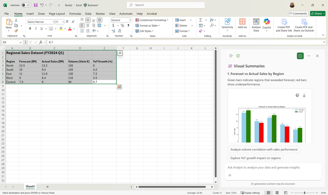

You need to evaluate actual regional sales compared to forecast, identify discrepancies, and provide recommendations for stakeholders.

## Example Regional Sales Data (FY2024 Q1)

| Region   | Forecast ($M) | Actual Sales ($M) | Volume (Units K) | YoY Growth (%) |
|----------|---------------|-----------------|-----------------|----------------|
| North    | 12.5          | 13.2            | 150             | 8.0            |
| South    | 10.0          | 9.5             | 120             | 4.2            |
| East     | 11.0          | 11.8            | 130             | 7.3            |
| West     | 9.0           | 8.4             | 110             | 2.5            |
| Central  | 7.5           | 8.0             | 90              | 6.7            |

## Steps

1. **Open Excel** with regional sales and forecast data.  
2. **Snap Excel alongside PowerPoint** using Windows 11 Snap Layouts.  
3. **Prompt Copilot in Excel**:  
   > "Compare actual sales versus forecast for each region. Highlight regions exceeding or underperforming against forecast. Generate visual summaries."  

   

4. Review Copilot-generated tables, charts, and insights.
5. Refine the output with other prompts as needed: 
   - "Highlight top 3 overperforming and underperforming regions in bullet points."  
   - "Simplify language for executive audience."  
6. **Transfer charts and insights to PowerPoint** by downloading or copying the information.  
7. **Use Copilot in PowerPoint** to summarize findings and draft recommendations for each region.

### Other metrics learners can calculate with Copilot

- Variance vs Forecast: `Actual Sales - Forecast`  
- Percent Over/Under Forecast: `(Actual Sales - Forecast) / Forecast * 100`  
- Highlight top 3 overperforming and underperforming regions.

### Example Copilot prompts

- `"Compare actual sales vs forecast for each region and highlight top 3 overperformers and underperformers."`  
- `"Generate a bar chart showing variance vs forecast by region."`  
- `"Provide a summary of which regions are exceeding or missing forecast and by how much."`
