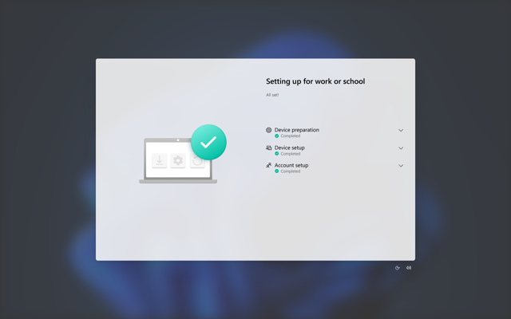

Windows Autopilot streamlines the deployment process into three simple steps:

## Device registration

Before a device can be deployed using Windows Autopilot, it must be registered with the Windows Autopilot deployment service.

To complete the registration, you need to:

- Capture and upload the device's unique [hardware identity](/autopilot/registration-overview#device-identification), known as a hardware hash, to the Windows Autopilot service.

- Associate the device with an Azure tenant ID.

### Customer-led registration

If you're a partner, you can perform these steps on an end user's behalf using the [registration authorization process](/autopilot/registration-auth). If you're an end user, you can choose to register devices themselves by collecting the hardware identity from new or existing devices and uploading it manually.

If the devices meet [certain requirements](/autopilot/automatic-registration#requirements), they can also be configured for automatic registration with Windows Autopilot.

### Registration methods

To learn about the different methods used to register devices with Windows Autopilot, select from the following articles on Microsoft Docs:

- [OEM registration](/autopilot/oem-registration)

- [Reseller, distributor, or partner registration](/autopilot/partner-registration)

- [Automatic registration](/autopilot/automatic-registration)

- [Manual registration](/autopilot/manual-registration)

### Upload the hardware hash

To identify a device with Windows Autopilot, the device's unique hardware hash must be captured and uploaded to the Windows Autopilot deployment service.

If you're an end user and you want to do this yourself, it's possible to identify a device with a [harvesting process](/autopilot/add-devices#collect-the-hardware-hash) that collects the device's hardware hash from within a running Windows installation.

### Hashes are a point-in-time

Hardware hashes include point-in-time details about a device. Hashes change each time they’re generated to reflect the device’s current state. When the Windows Autopilot deployment service attempts to match a device, it takes these changes into consideration—up to a point.

### When to make new hashes

The Windows Autopilot deployment service matches a device even if moderate changes were made to the hardware. For example, if you change the hard drive in a device the Windows Autopilot deployment service can still match it. Keep in mind, the Windows Autopilot deployment service will NOT match a device after major changes to the hardware, like swapping out the motherboard. When there has been a major change to a device, a new hash needs to be generated and uploaded to the Windows Autopilot deployment service.

### What’s in a hardware hash?

- Manufacturer

- Model

- Device serial number

- Hard drive serial number

- Details about when the ID was generated

- Many other attributes that can be used to uniquely identify the device

For more information about device IDs, check out the [device guidelines](/autopilot/autopilot-device-guidelines) and [add devices to a customer account](/partner-center/customers/autopilot) pages.

## Profile creation and assignment

Devices registered in Windows Autopilot must be assigned a profile. Creating and assigning a profile allows you to customize the setup and configuration of a device. If a device isn’t assigned a profile after registration, then it will receive a default Windows Autopilot profile.

Let’s say you have a device that you don’t want to go through Windows Autopilot. In that case, you would need to remove the Windows Autopilot registration from the device in order to avoid profile assignment.

### Verify registration success

You can verify if a device has successfully registered with the Windows Autopilot deployment service. Registered devices appear in the Intune admin center under one of the following paths:

*Devices → Windows → Enrollment → (Windows Autopilot) Devices* or *Devices → Enrollment → Windows → (Windows Autopilot) Devices*

### Intune is NOT Autopilot

Windows Autopilot devices aren't the same as Microsoft Intune devices listed under:

*Devices > Windows | Windows devices* 

Windows Autopilot devices are added to the list of Windows devices only when both of these requirements are met:

- The Windows Autopilot registration process is successful.

- The device has gone through Out-Of-Box Experience provisioning and a licensed user has signed in on the device.

## Provide device to the end user

That’s it! The device is now ready.

When you power on your device, all you need to do is:

- Connect the device to the internet.
- Answer some quick setup questions.

Windows Autopilot handles the rest by installing all the preconfigured apps and settings via the cloud.

### Enrollment Status Page

When a user signs into a device for the first time, the Enrollment Status Page (ESP) displays the device's configuration progress.

The ESP makes sure the device is in the expected state before the end user can access the desktop for the first time. It tracks the installation of applications, security policies, certificates, and network connections.

[ESP and ESP profiles](/autopilot/enrollment-status)

