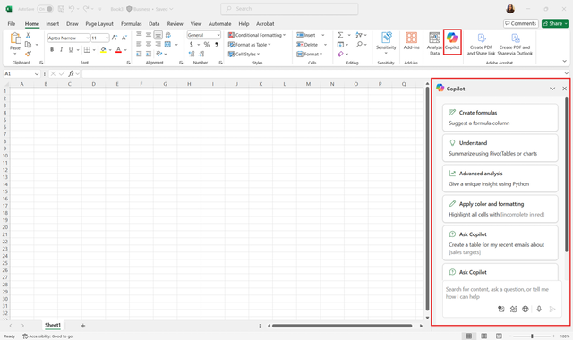

Microsoft Excel is the go-to tool for organizing data, building reports, and performing detailed analysis. From tracking budgets and forecasting sales to analyzing customer feedback or inventory, Excel is where many professionals transform raw numbers into meaningful insights. Yet, working efficiently in Excel can be a challenge. Even experienced users sometimes struggle to remember complex formulas, build accurate charts, or prepare data for reporting. Searching online for syntax examples or experimenting with multiple chart types can eat away at valuable time that could otherwise be spent making decisions.

Now imagine a real-world scenario. You’re a financial analyst tasked with preparing a quarterly performance report for leadership. You gathered data from multiple departments, but you need to clean it up, calculate key metrics, and present results in a way that tells a clear story. Normally, this might involve hours of writing formulas, double-checking cell references, and creating pivot tables. With deadlines looming, mistakes can slip in, and even small errors might reduce the credibility of your report.

This is where Copilot Chat in Microsoft Excel comes in. Copilot Chat acts like an assistant who understands both your intent and the language of Excel. Instead of looking up formulas or experimenting through trial and error, you can type your request in plain language. For example, you might ask:

*"Show me the formula for calculating the year-over-year growth rate."*

*"Create a chart that compares revenue by product line."*

*"Summarize the top five customers by sales volume."*

Copilot Chat interprets these natural language requests and provides formulas, summaries, or visualizations directly in your workbook. You can then refine the results by asking follow-up questions or adjusting the output, just as you would with a colleague. Copilot can also explain how each formula works, helping you understand the logic behind calculations while building your skills in Excel. 

Learners with a Microsoft 365 Copilot license have access to advanced AI features in Excel both directly in the spreadsheet and by selecting App skills from the drop-down menu of the Copilot button in the app ribbon.​​​​​​​

By the end of this module, you’ll be able to use Copilot Chat in Microsoft Excel to analyze data efficiently and create accurate reports.

## Learning objectives

- Generate formulas that calculate results quickly and accurately.
- Summarize data and create visualizations that highlight key insights.
- Automate routine Excel tasks to save time and reduce errors.