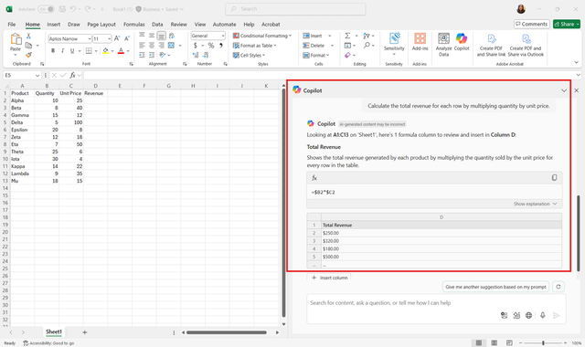

Formulas are the foundation of Microsoft Excel. They allow you to perform calculations, analyze trends, and extract insights from your data. However, Excel includes hundreds of functions, each with its own syntax and purpose, which can make building formulas a challenge. Even experienced users may forget the correct function names, the order of arguments, or how to handle special cases like blank cells or errors.

Copilot Chat in Excel helps overcome these challenges by translating natural language questions into fully working formulas. You don’t need to remember syntax or search documentation online; instead, you describe what you want to calculate as you would in a regular conversation. Copilot then generates the appropriate formula and can provide suggestions for refinement.

For example, consider a dataset of sales transactions with columns for Product, Quantity, Unit Price, and Revenue. Instead of manually writing a formula for Revenue as *=Quantity*UnitPrice* and dragging it down thousands of rows, you can ask Copilot Chat:

- *“Calculate total revenue for each row by multiplying quantity by unit price.”*

Copilot responds with the correct formula and inserts it in your workbook, saving time and reducing the risk of errors.

> [!IMPORTANT]
> For Copilot to read your data correctly, make sure it is formatted as a table or in a supported range. This ensures that formulas, summaries, and visualizations work as expected.

Copilot Chat is not limited to simple arithmetic. You can generate more advanced formulas, including:

- **Conditional calculations**: Use functions like IF, SUMIF, or AVERAGEIF to calculate results based on specific conditions. Example: **“Calculate total sales only for Product A.”*

- **Text manipulation**: Concatenate strings, extract substrings, or clean up text using functions like CONCAT, LEFT, RIGHT, or TRIM. Example: *“Combine first and last names into a full name column.”*

- **Date and time calculations**: Compute differences between dates, extract month or year values, or calculate deadlines using functions like DATEDIF, YEAR, or WORKDAY. Example: *“Calculate the number of business days between order date and delivery date.”*

By understanding these types of formulas conceptually, you’ll be able to guide Copilot Chat more effectively and make informed decisions about which formulas best suit your scenario.

> [!TIP]
>
> When generating formulas with Copilot Chat:
>
> - **Start with a clear question or instruction**. The more specific you are, the more accurate the generated formula.
>
> - **Review the formula before applying it** across your dataset to ensure it matches your intended calculation.
>
> - **Use follow-up questions to refine the formula**, for example: *“Adjust the formula to ignore blank cells.”*
>
> Using Copilot Chat in this way turns formula creation from a trial-and-error process into a faster, more reliable workflow, helping you focus on analyzing results rather than troubleshooting syntax errors.