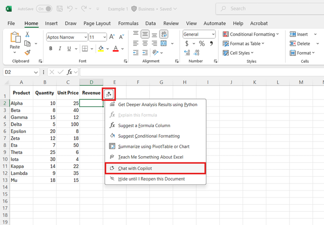
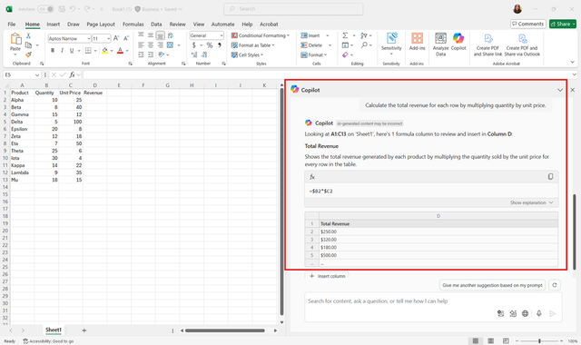
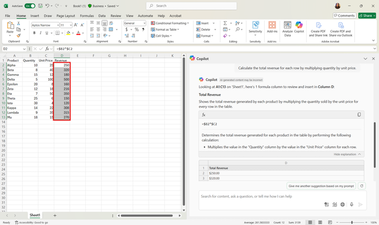

In this exercise, you’ll practice using Copilot Chat to create formulas that perform calculations automatically. By the end, you’ll be able to generate formulas for a variety of scenarios, test them, and refine them using follow-up instructions.

> [!NOTE]
> You can access Copilot Chat in Excel either by selecting the Copilot icon in the ribbon or by selecting the sparkle icon that appears when you select a specific cell.
>
> 

## Steps

**1. Open your workbook**

Open a new Excel workbook. Enter the following data manually into the blank Excel worksheet. Leave the **Revenue** column blank so you can practice using Copilot Chat to create formulas.

| Product  | Region | Quarter | Quantity | Unit Price | Revenue |
|----------|--------|---------|----------|------------|---------|
| Alpha    | North  | Q1      | 10       | 25         |         |
| Beta     | South  | Q1      | 8        | 40         |         |
| Gamma    | East   | Q1      | 15       | 12         |         |
| Delta    | West   | Q1      | 5        | 100        |         |
| Epsilon  | North  | Q2      | 20       | 8          |         |
| Zeta     | South  | Q2      | 12       | 18         |         |
| Eta      | East   | Q2      | 7        | 50         |         |
| Theta    | West   | Q2      | 25       | 6          |         |
| Iota     | North  | Q3      | 30       | 4          |         |
| Kappa    | South  | Q3      | 14       | 22         |         |
| Lambda   | East   | Q3      | 9        | 35         |         |
| Mu       | West   | Q3      | 18       | 15         |         |

> [!IMPORTANT]
> Keep the workbook you created in this exercise — we'll use it again in the next exercise.

**2. Open Copilot Chat**

Access Copilot Chat from the Excel ribbon, sidebar, or sparkle icon. A chat window appears where you can type instructions.

**3. Ask Copilot to create a formula**

In the chat box, type:

*"Calculate total revenue for each row by multiplying quantity by unit price."*
Copilot will generate the formula, for example, =Quantity*UnitPrice, which you can then copy and paste into any cell where you want the calculation.

> [!TIP]
> **Experiment with variations**. Try asking Copilot for multiple approaches to the same calculation to see different formulas and decide which works best for your scenario.

**4. Apply the formula to multiple rows**

Drag the fill handle down the column to apply the formula to all relevant rows. Verify that the results are correct for each row.

**5. Test with a conditional formula**

Ask Copilot:

*"Calculate total revenue only for Product A."*
Copilot may generate a formula using SUMIF or similar. Insert the formula in a new cell and confirm the result matches your expected calculation.

**6. Refine the formula**

If your dataset contains blank or missing values, you can ask Copilot to:

*"Adjust the formula to ignore blank cells."*
Copilot will suggest modifications such as using IF or IFERROR to handle exceptions.

### Bonus exercises

Use our example dataset to practice these exercises with Copilot Chat:

- Combine Product and Region into a single column (Example: “Alpha – North”).
- Calculate total Revenue only for Q1 using SUMIF or a similar formula.
- Create a column that flags high-value transactions, such as Revenue greater than 300.
- Generate a formula with Copilot and ask it to explain how it works.
- Calculate percentage growth in Revenue from Q1 to Q2 for each product.
- Combine multiple functions, such as IF and SUMIF, to calculate conditional totals.
- Create a new column to calculate average Unit Price by Region using a formula.

These extra exercises will help you practice using Copilot Chat to build and adjust formulas, so working with Copilot Chat in Excel feels faster and simpler.