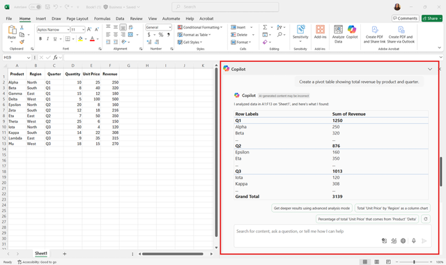

Once formulas are in place, the next step is to turn raw numbers into insights that are easy to interpret and share. Summarizing and visualizing data helps you identify trends, spot outliers, and communicate results clearly to stakeholders. While Excel provides a wide range of tools for creating pivot tables, charts, and summary tables, deciding which approach to use and configuring it correctly can take time. Copilot Chat can accelerate this process by suggesting ways to summarize your data and generating charts or tables directly in your workbook.

For example, imagine your dataset contains sales information for multiple products over several quarters. You want to answer questions like:

- Which products contributed the most to total revenue?

- How has revenue changed quarter over quarter?

- What trends are visible across regions or product categories?

Traditionally, you would need to create a pivot table, select the correct rows, columns, and values, and apply filters to focus on specific metrics. Then, you would choose an appropriate chart type and manually format it for clarity. Copilot Chat simplifies this workflow. By asking Copilot to summarize or visualize your data, you can generate pivot tables, charts, and summary tables quickly.

Copilot Chat can help you create various visualizations and summaries, and it can also highlight, sort, and filter your data based on your instructions. For example, you could ask Copilot to highlight cells with numbers greater than five or filter your dataset to focus on specific metrics.

Copilot Chat can create:

- **Pivot tables**: Summarize data by categories, regions, or time periods, and calculate totals, averages, or counts. Example: *"Create a pivot table showing total revenue by product and quarter."*

- **Charts**: Generate bar charts, line graphs, pie charts, or scatter plots to visualize trends and comparisons. Example: *"Create a line chart comparing revenue across all quarters."*

- **Data summaries**: Produce text-based summaries of top-performing products or key metrics. Example: *"Summarize the top three products by total sales."*

Using Copilot Chat for summarization and visualization offers several advantages:

- **Speed**: Generate pivot tables or charts in seconds rather than minutes.

- **Accuracy**: Reduce the risk of incorrectly setting fields or aggregations.

- **Guidance**: Receive suggestions for the most effective visualization based on the data type and question.

> [!TIP]
>
> - Clearly describe the insight you want to gain. For example, specify the metric, grouping, or comparison you need.
>
> - Review the suggested pivot tables or charts to ensure they match your intended analysis.
>
> - Ask follow-up questions to refine summaries or visualizations, such as changing the chart type, adjusting labels, or filtering specific data.
>
> By using Copilot Chat, you can focus on interpreting the results and making data-driven decisions rather than spending time building and formatting summaries manually.