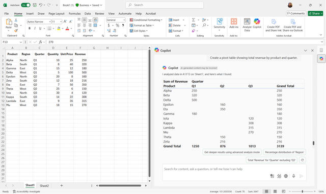
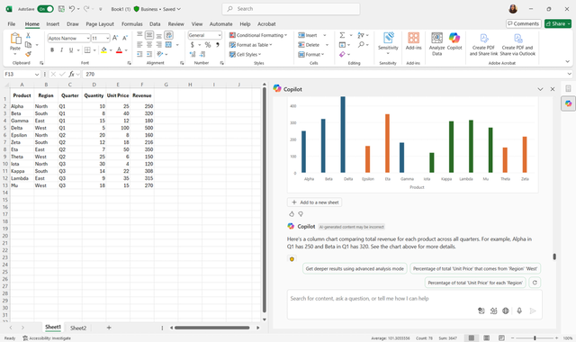
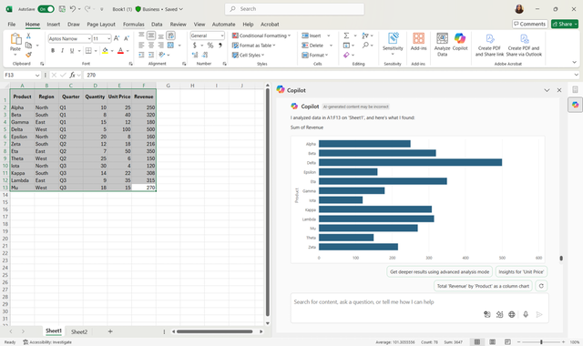
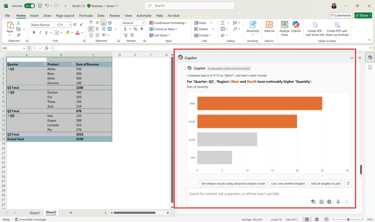

In this exercise, you’ll practice using Copilot Chat to summarize data and create visualizations. By the end, you’ll be able to generate pivot tables, charts, and text-based summaries, refine them using follow-up instructions, and present insights clearly.

## Steps

**1. Open your workbook**

Open the Excel workbook containing the sales dataset you used in Exercise 1. Make sure it includes columns for **Product**, **Region**, **Quarter**, **Quantity**, and **Revenue**. If needed, you can copy the table provided:

| Product  | Region | Quarter | Quantity | Unit Price | Revenue |
|----------|--------|---------|----------|------------|---------|
| Alpha    | North  | Q1      | 10       | 25         | 250     |
| Beta     | South  | Q1      | 8        | 40         | 320     |
| Gamma    | East   | Q1      | 15       | 12         | 180     |
| Delta    | West   | Q1      | 5        | 100        | 500     |
| Epsilon  | North  | Q2      | 20       | 8          | 160     |
| Zeta     | South  | Q2      | 12       | 18         | 216     |
| Eta      | East   | Q2      | 7        | 50         | 350     |
| Theta    | West   | Q2      | 25       | 6          | 150     |
| Iota     | North  | Q3      | 30       | 4          | 120     |
| Kappa    | South  | Q3      | 14       | 22         | 308     |
| Lambda   | East   | Q3      | 9        | 35         | 315     |
| Mu       | West   | Q3      | 18       | 15         | 270     |

**2. Open Copilot Chat**

Access Copilot Chat from the Excel ribbon, sidebar, or sparkle icon by a selected cell.

**3. Generate a pivot table**

In the chat box, type:

*"Create a pivot table showing total revenue by product and quarter."*
Copilot generates the pivot table and provide it to you. You can then copy and paste it into a worksheet. Check that the pivot table lists the correct products, quarters, and revenue values.

**4. Create a chart**

With the pivot table selected, ask Copilot:

*"Create a column chart comparing total revenue for each product across all quarters."*
Copilot provides a column chart for you to copy and paste. You can move or resize it as needed.

**5. Refine the visualization**

Ask Copilot follow-up questions to improve clarity:

- *"Add data labels to the chart."*

- *"Change the bar chart colors to match my theme."*

- *"Filter the bar chart to show only the top five products."*

**6. Generate a text-based summary**

Ask Copilot:

*"Summarize the top three products by total sales and highlight any trends."*
Copilot provides a concise written summary that you can insert into your report.

### Bonus exercises

Use our example dataset to explore other ways to summarize and visualize data with Copilot Chat:

- Generate a line chart showing Revenue trends by Region over time.
- Create a pivot table summarizing average Quantity sold by Product or by Region.
- Highlight, sort, or filter your data based on specific criteria, such as Revenue above 300 or a particular Region.
- Forecast Revenue for the next several quarters using your dataset.
- Generate a pivot table summarizing Revenue by Region and Quarter.
- Create a pie chart showing the proportion of total Revenue contributed by each Product.
- Produce a text summary highlighting trends in Revenue growth over multiple quarters.

These exercises help you explore more ways to use Copilot Chat for summarizing and visualizing data, building confidence with multiple analysis techniques.