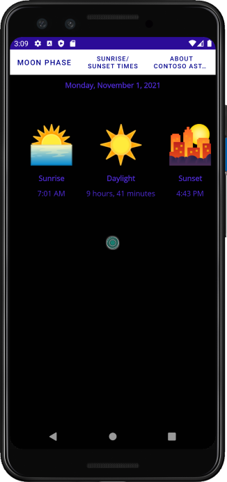
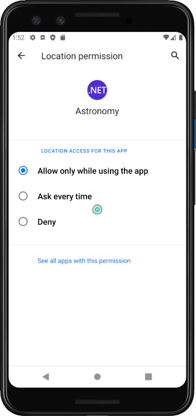

In the sample scenario, you have a MAUI app that contains a number of pages for displaying information about astronomical bodies, the phases of the moon, and sunrise/sunset times. The app also includes an About page. Currently, these pages are all stand-alone, but you want to provide a logical way for the user to move between them.

In this exercise, you'll add tab navigation to the app.

## Open the starter solution

1. Clone or download the [exercise repo](https://repo.address.to.go.here).

    > [!NOTE]
    > It is best to clone or download the exercise content to a short folder path, such as C:\dev\, to avoid build-generated files exceeding the maximum path length.

1. Go to the **exercise1** folder in the cloned repo, and then move to the **start** folder.

1. Use Visual Studio to open the **Astronomy.sln** solution.

1. In the **Solution Explorer** window, in the **Astronomy** project, expand the **Pages** folder. Note that this folder contains the following pages:

    - **AboutPage**. This page displays *about* information for the app.
    - **MoonPhasePage**. This page displays specific information about the phases of the Moon as seen from Earth.
    - **SunrisePage**. This page displays sunrise and sunset times for locations on Earth. The data is provided by the [Sunrise Sunset web service](https://sunrise-sunset.org/api).

1. Build and run the app. When the app starts, the **MainPage** shows a title, but currently there's no means provided to enable the user to navigate to the other pages.

    The image below shows the app running on the Android emulator:

    :::image type="content" source="../media/3-initial-app-android.png" alt-text="The Astronomy app running on Android. The functionality required to navigate to pages is missing.":::

1. Close the app and return to Visual Studio.

## Convert MainPage to a TabbedPage

1. In the Solution Explorer window, open the **MainPage.xaml** file.

1. In the XAML markup page, change the root node from `ContentPage` to `TabbedPage`, remove the `ContentPage.Resources` node, and remove the `StackLayout` element. The markup should look like this:

    ```xml
    <TabbedPage xmlns="http://schemas.microsoft.com/dotnet/2021/maui"
                xmlns:x="http://schemas.microsoft.com/winfx/2009/xaml"
                x:Class="Astronomy.MainPage"
                Title="Contoso Astronomy"
                BackgroundColor="Black">

    </TabbedPage>
    ```

1. Set the `BarBackground` property of the `TabbedPage` to `White`, and the `BarTextColor` property to `DarkBlue`. These settings should make the labels for each tab stand out against the black background of the page:

    ```xml
    <TabbedPage ...
                BarBackgroundColor="White"
                BarTextColor="DarkBlue">
    ```

1. Add the XML namespace **local** shown below to the `TabbedPage`. This namespace brings the .NET namespace containing the child pages into scope:

    ```xml
    <TabbedPage ...
                xmlns:local="clr-namespace:Astronomy.Pages"
                ...>
    ```

1. Add a `TabbedPage.Children` element to the body of the `TabbedPage`. This element creates tabs for the `MoonPhasePage`, `SunrisePage`, and `AboutPage` pages:

    ```xml
    <TabbedPage...>

        <TabbedPage.Children>
            <local:MoonPhasePage />
            <local:SunrisePage />
            <local:AboutPage />
        </TabbedPage.Children>
    </TabbedPage>
    ```

1. Open the **MainPage.xaml.cs** file.

1. Change the base type of the class from `ContentPage` to `TabbedPage`.

    ```csharp
    public partial class MainPage : TabbedPage
    {
        ...
    }
    ```

1. Build and run the app. When the app starts, the first tab will be visible by default, and you can select the tabs to switch pages. The image below shows the app running on an Android device. The user has selected the **Sunrise/Sunset Times** tab:

    

    > [!NOTE]
    > If you are running on a platform other than Windows, you may need to enable Location permission for your app on that platform for the **Sunrise/Sunset Times** page to work. For example, on an Android device, set Location access to **Allow only while using the app**:
    >
    > 

1. Close the app and return to Visual Studio when you have finished browsing the data.

## Change labels and add icons for the tabs

1. The default labels for the **Sunrise/SunSet** and **About** tabs are too long to be displayed properly on some mobile devices. In the **MainPage.xaml** file, provide shorter titles for these tabs:

    ```xml
    <TabbedPage.Children>
        <local:MoonPhasePage />
        <local:SunrisePage Title="Daylight" />
        <local:AboutPage Title="About" />
    </TabbedPage.Children>
    ```

1. Using the Solution Explorer window, add the three image files **moon.png**, **sun.png**, and **question.png** from the **exercise1/assets** folder to the **Images** folder under the **Resources** folder.

    :::image type="content" source="../media/3-solution-explorer.png" alt-text="The Solution Explorer window. The user has added the image files to the Resources/Images folder.":::

1. In the **MainPage.xaml** file, set the `IconImageSource` property for each tab:

    ```xml
    <TabbedPage.Children>
        <local:MoonPhasePage IconImageSource="moon.png"/>
        <local:SunrisePage Title="Daylight" IconImageSource="sun.png"/>
        <local:AboutPage Title="About" IconImageSource="question.png"/>
    </TabbedPage.Children>
    ```

1. Finally, to make the selected tab stand out, remove the `BarTextColor` property from the `TabbedPage`, and instead set the `SelectedTabColor` and `UnselectedTabColor` properties as shown below:

    ```xml
    <TabbedPage ...
            SelectedTabColor="DarkBlue"
            UnselectedTabColor="LightGrey">
    ```

1. Build and run the app. When the app starts, you should see the new titles and icons for each tab:

    :::image type="content" source="../media/3-tabs-with-icons.png" alt-text="The app running on an Android device. The tabs have icons":::

1. Close the app and return to Visual Studio.