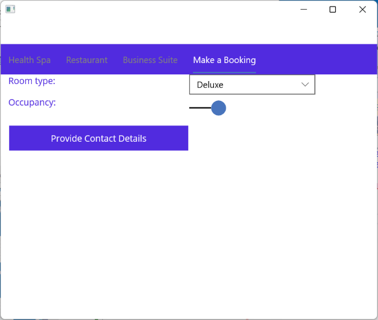

<!-- Navigation Pages within Tabbed Pages don't currently appear to be working on Android or iOS. I have followed the instructions from the video at https://www.youtube.com/watch?v=YDxQjb7N-P8, and everything works (ish) for Windows, but not for the other platforms-->

Tabbed pages are just one way of enabling a user to navigate through the data presented by an app. Another technique is to use stack navigation. Each type of navigation is suited towards different types of relationships between pages.

You can use stack navigation in conjunction with tabbed pages. In this unit, you'll briefly review the differences between tab navigation and stack navigation, learn how to build apps that combine both techniques.

## Review of tab navigation and stack navigation

Tabbed pages provide a useful mechanism for enabling the user to select which page to view at any one time. The user navigates to a page simply by selecting the appropriate tab. This form of navigation is useful for data items that have a *peer* relationship with each other. In the astronomy app, the Sun, Moon, and About pages are all peers; there's no direct relationship between them.

However, for hierarchical data, stack navigation may be more appropriate. Stack navigation enables the user to *drill down* a series of pages, where the next page in the stack provides a more detailed view of a selected item on the previous page.

Consider the following scenario:

You're building an app for a hotel that enables a user to browse the facilities offered by the hotel, and book a room. The app provides different pages describing each of the facilities (the health spa, the restaurant, the business suite, etc.), and a separate page for making a booking. The booking process requires the user to follow a specific process; select a room, provide their name and contact information, and finally input payment details for making a reservation. The pages listing the facilities would be best presented as a set of tabbed pages. The booking process is better implemented as a series of steps presented using stack navigation (this mechanism will also enable the user to return to a previous step to make any alterations or corrections).

## Integrate navigation pages into a tabbed page

Before you combine stack navigation with a tabbed page, you need to ask one fundamental question: When the user *drills down* into a series of pages from a tabbed page by using stack navigation, should the pages be displayed within the current tab, or should the user navigate away from the tabbed page entirely? This consideration can have an effect on how users perceive your application. There's no single correct answer; it depends on the application you're building and the data you wish to display. The diagram below illustrates how this question affects the structure of the hotel app.

<!-- The following image requires the attention of a graphic artist -->

:::image type="content" source="../media/6-hotel-app-structure.png" alt-text="The navigation structure and page hierarchy of the hotel app.":::

The following sections describe how to implement each of these approaches.

### Navigate away from the tabbed page

To support stack navigation, a page must provide a navigation stack. To do this, you wrap it in a `NavigationPage` object. In the hotel app example, the `TabbedPage` is the root of the navigation stack. The code that creates this page in the **App.xaml.cs** should look like this:

```csharp
namespace HotelApp
{
    public partial class App : Application
    {
        public App()
        {
            InitializeComponent();

            MainPage = new NavigationPage(new MainPage());
        }
    }
}
```

The XAML markup for `MainPage` looks like an ordinary tabbed page. The child pages are regular `ContentPage` items:

```xml
<TabbedPage ...
            xmlns:pages="clr-namespace:HotelApp.Pages"
            ...>

    <TabbedPage.Children>
        <pages:HealthSpaPage Title="Health Spa"/>
        <pages:RestaurantPage Title="Restaurant"/>
        <pages:BusinessSuitePage Title="Business Suite"/>
        <pages:SelectRoomPage Title="Make a Booking"/>
    </TabbedPage.Children>
</TabbedPage>
```

In this example, the *Select a Room* page appears in the tabbed page:

> [!NOTE]
> The following images should be replaced with screen shots from the Android Emulator once Navigation Pages are working within Tabbed Pages on Android.
> We're waiting on the .NET MAUI product team to catch up to us.



Once the user has selected the room, the page provides a button that enables the user to move on to the *Provide Contact Details* page (in the hotel example, this page is implemented by the `ContactDetailsPage` class). The code behind this button on the *Select a Room* page creates a new `ContactDetailsPage`, and wraps it in a `NavigationPage`, before navigating to it:

```csharp
namespace HotelApp.Pages
{
    public partial class SelectRoomPage: ContentPage
    {
        ...

        async void OnProvideContactDetails(object sender, EventArgs args)
        {
            await Navigation.PushAsync(new ContactDetailsPage());
        }
    }
}
```

The `ContactDetailsPage` is similar. It enables the user to enter their details, and then proceed to the *Make Reservation* page implemented by the `ReservationPage` class. However, the tab navigation bar has disappeared, and is replaced with a stack navigation bar with a *back arrow*. The user can select this arrow to move back to the previous page if necessary (the tabs will also reappear):

:::image type="content" source="../media/6-enter-contact-details-page.png" alt-text="The Contact Details page of the hotel app. The tab bar has disappeared and a navigation bar has replaced it.":::

The `Clicked` event handler for the button on this page looks like this:

```csharp
public partial class ContactDetailsPage : ContentPage
{
    ...
    async void OnMakeReservation(object sender, EventArgs args)
    {
        await Navigation.PushAsync(new ReservationPage());
    }
    }
```

Finally, the *Make Reservation* page enables the user to reserve the room and provide payment details. As before, the navigation bar contains a *back arrow* that enables the user to return to the previous page:

:::image type="content" source="../media/6-reserve-room-page.png" alt-text="The Reserve Room page of the hotel app.":::

The *Reserve Room* button completes the reservation. The process has now finished, so the user is returned back to the top of the navigation stack:

```csharp
public partial class ReservationPage : ContentPage
{
    ...
    async void OnFinish(object sender, EventArgs args)
    {
        ...
        await Navigation.PopToRootAsync(); // return to the top of the navigation stack
    }
}
```

This action causes the *Select a Room* page to be displayed. This is a tabbed page, and so the tab bar reappears and the navigation bar disappears.

## Navigate within the current tab

The previous section walked through the process of using navigation stack to temporarily move away from the tabbed page. While the navigation stack is active, the tabs are unavailable. An alternative approach is to enable stack navigation within the tabbed page. In this scenario, the tabs remain active, but the navigation stack for the selected tab enables you to move back and forth between navigation pages.

To implement stack navigation within a tabbed page, you relocate the navigation stack from the tabbed page to the page you want to act as the root of the navigation stack. In the Hotel app example, this means that you instantiate the `TabbedPage` without wrapping it in a `NavigationPage` in the **App.xaml.cs** file: (this is the default)

```csharp
namespace HotelApp
{
    public partial class App : Application
    {
        public App()
        {
            InitializeComponent();

            MainPage = new MainPage(); // Don't wrap in a NavigationPage
        }
    }
}
```

The *Make a Booking* page should be the root of the navigation stack. In the XAML markup for the tabbed page, you can add a `NavigationPage` wrapper around the code that creates the tab for `SelectRoomPage`. The `x:Arguments` element provides any parameters required for creating the new navigation page; in this case, the parameter is the `SelectRoomPage` object. Notice that the tab title is added to the `NavigationPage` rather than the `SelectRoomPage` element:

```xml
<TabbedPage ...
            xmlns:pages="clr-namespace:HotelApp.Pages"
            ...>

    <TabbedPage.Children>
        <pages:HealthSpaPage Title="Health Spa"/>
        <pages:RestaurantPage Title="Restaurant"/>
        <pages:BusinessSuitePage Title="Business Suite"/>
        <NavigationPage Title="Make a Booking">
            <x:Arguments>
                <pages:SelectRoomPage/>
            </x:Arguments>
        </NavigationPage>
    </TabbedPage.Children>
</TabbedPage>
```

When the app runs and the user selects the *Make a Booking* tab, they can proceed through the booking process as before. However, this time the other tabs remain active below the navigation bar:

:::image type="content" source="../media/6-navigation-with-tab-page.png" alt-text="The Contact Details page of the hotel app. The tab bar is still visible together with the navigation bar.":::

The user can select any of the remaining tabs and they'll function as before. If the user switches back to the *Make a Booking* tab, they'll be returned to the current page on the navigation stack. By default, the navigation bar remains visible but inactive when the user isn't on the *Make a Booking* tab. In some circumstances this may be confusing to the user, so you should be prepared to fine-tune the user interface accordingly.

> [!NOTE]
> While a `NavigationPage` can be placed in a `TabbedPage`, it's not recommended to place a `TabbedPage` into a `NavigationPage` as it may not work properly on an iOS device.
<!-- This recommendation is from https://docs.microsoft.com/en-us/xamarin/xamarin-forms/app-fundamentals/navigation/tabbed-page -->