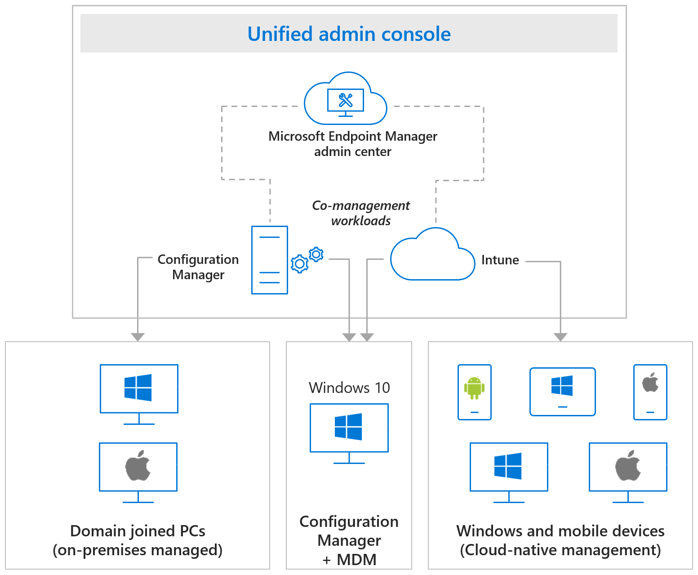

Effectively managing endpoints presents a number of challenges. For instance, how do you manage existing investments? How do you provide proper security in the form of access control and encryption? How do you determine which user, device, or app is in compliance based on your corporate requirements? 

Microsoft Intune provides the services and tools you need in one location to manage your organization's endpoints by providing:

- **Cloud security across endpoints**: You can help protect user devices against threats using [Microsoft Zero Trust](/security/zero-trust/) technology.
- **Comprehensive Windows 10/11 management**: You can simplify automated provisioning, configuration management, and software updates for all your endpoints.
- **Maximum return on investment**: You can leverage your existing investments to modernize the user experience with Microsoft 365 cloud telemetry.

## Endpoint architecture

The Microsoft Intune architecture provides three stages of the cloud management journey using Configuration Manager and Intune in a single, unified endpoint-management solution.

The first stage uses tenant-attach capabilities, which provide the most flexible path for Configuration Manager customers to start gaining cloud benefits without necessarily enrolling their Windows clients with Intune. When you connect the Configuration Manager site to the cloud, you immediately gain access to a host of remote actions and analytics.

Organizations ready for the next step can use co-management to manage Windows using both Configuration Manager and Intune. Your Windows 10/11 device is managed by both Configuration Manager and mobile device management (MDM) systems in the second stage. We recommend new customers or new endpoints go directly to the cloud with Intune. Existing customers can gradually move more workloads to the cloud in the third stage.

 ](../media/intro-to-endpoint-manager-08.png#lightbox)

## Modern endpoint Management

Modern IT provides cloud intelligence at the core. Microsoft Intune provides this modern management. Microsoft Intune doesn't require you to make an either/or decision between on-premises and cloud management; you can do both and modernize at your own pace to manage risk in a smart way. You can take advantage of modern IT and the cloud by using Microsoft Intune, which also gives you the tools and capabilities to manage your existing on-premises investments.

Suppose you're the administrator or business decision maker of a company with several thousand employees. Your company must determine the best way to implement an Enterprise Mobility Management service that keeps your corporate data safe, protects the data, apps, and devices that your employees use, and maximizes return on your investment. Learn how Microsoft Intune provides these capabilities.

## Learning objectives

In this module, you'll:

- Learn about intelligent and unified endpoint security.
- Learn about flexible and unified endpoint management.
- Learn about protecting data without device enrollment.
- Understand how Microsoft Intune increases your end users' productivity.
- Learn about the benefits of co-management.
- Learn how Microsoft Intune helps you maximize your return on investment.

## Prerequisites

- None
