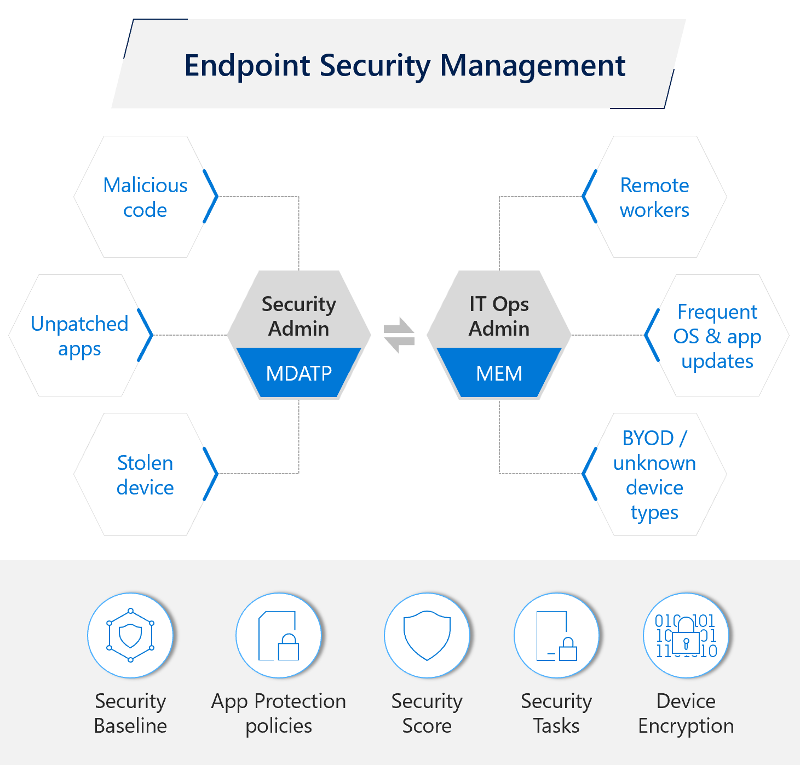
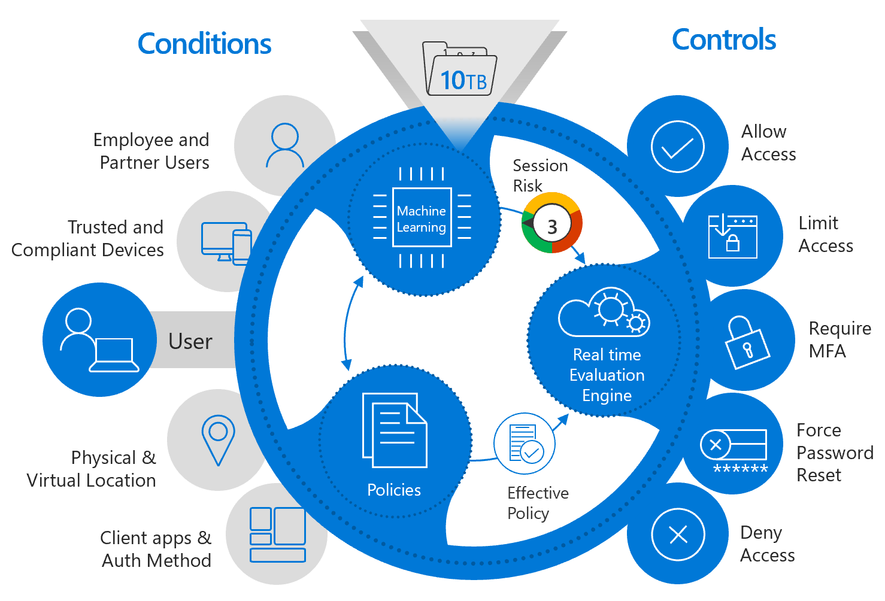

Microsoft Intune provides native integration with cloud-powered security controls and risk-based Conditional Access for apps and data, which provides intelligent and unified endpoint security.

## Intelligent security

Intune enables a unique set of capabilities to simplify endpoint security management, which includes:

- **Security Baselines**: Simplify migration to policy settings using security baselines. Security baselines are pre-configured groups of Windows settings that help you apply a known group of settings and default values that we recommend. When you create a security baseline profile in Intune, you're creating a template that consists of multiple *device configuration* profiles.
- **BitLocker Management**: BitLocker-based modern encryption management. BitLocker is a data-protection feature that integrates with the Windows 10/11 operating system, and addresses the threats of data theft or exposure from lost, stolen, or inappropriately decommissioned computers.
- **Advanced Threat Protection**: Microsoft Defender Advanced Threat Protection (Microsoft Defender ATP), along with its partners for iOS and Android, provides a comprehensive Mobile Threat Defense solution.
- **Secure Score**: Secure Score helps you assess your workload security posture by recommending a prioritized list of security vulnerabilities for remediation.
- **Windows Hello for Business**: Windows Hello is passwordless authentication for Windows 10/11.

The following image shows the tools to endpoint security management, as well as the endpoint security threats and concerns:

## Unified security

You can securely access corporate resources through continuous assessment and intent-based policies with Conditional Access app control, powered by Microsoft Entra ID and natively integrated in Microsoft Intune. Unified security management with Microsoft Defender for Intune enables quick, automated remediation of app vulnerabilities.

Microsoft Intune helps ensure cross-platform device controls to help manage your Zero Trust endpoint strategy, which includes:

- **Endpoint compliance and risk:**
  - Adapt in real time to changes in device health
  - Leverage Microsoft 365 cloud to evaluate risks
  - Determine risks calculated based on advanced Microsoft machine learning
- **Conditional Access:**
  - Define contextual policies at the user, location, device, and app levels
  - Evaluate compliance that Microsoft Entra ID enforces to provide Conditional Access
- **App Protection Policy:**
  - Protect apps and Office365 data on unmanaged devices.
- **Extend native platform security to meet all use cases**
- **Third-party risk and compliance signaling**

The following image shows the cross-platform device controls to help provide trust, as well as the conditions that must stay within compliance:  

