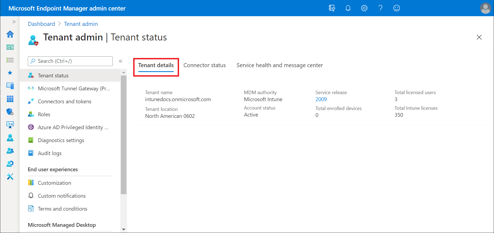

The Microsoft Intune Tenant Status page is a centralized hub where you can view current and important details about your tenant. A tenant is a representation of an organization. It's a dedicated instance of Microsoft Entra ID that an organization receives when the organization signs up for Microsoft Intune.

> [!NOTE]
> Microsoft Entra ID is the underlying infrastructure that supports identity management for all Microsoft cloud services. Microsoft Entra ID stores information about license-assignment states for users. Your subscription to Intune is hosted by a Microsoft Entra tenant.

Tenant details provide at-a-glance information about your tenant. View details like your tenant name and location, your MDM Authority, and your tenant's service release number. The service release number is a link that opens the *What's new in Intune* article on Microsoft Learn. In *What's new*, you can read about the latest features and updates to the Intune service. The tenant status also provides the total end user licenses in use and available.

