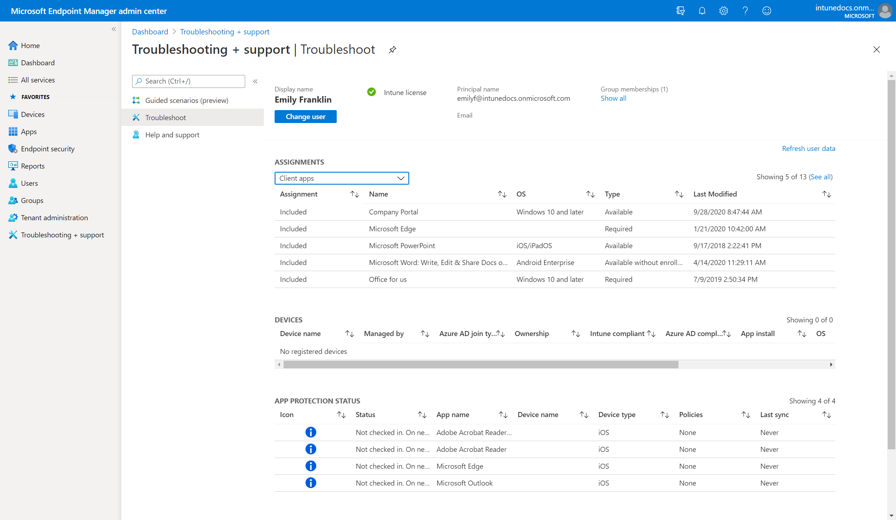

The **Troubleshoot** pane lets help desk operators and Intune administrators view user information to address user help requests. Organizations that include a help desk can assign the **Help desk operator** role to a group of users. The Help desk operator role can use the **Troubleshoot** pane.

The **Troubleshoot** pane also shows user-enrollment issues. Details about the issue and suggested remediation steps can help administrators and help desk operators troubleshoot problems. Certain enrollment issues aren't captured and some errors might not have remediation suggestions.

When a user contacts support with a technical issue with Intune, the help desk operator enters the user's name. Intune shows useful data that can help resolve many tier-1 issues, including:

- User status
- Assignments
- Compliance issues
- Device not responding
- Device not getting VPN or Wi-Fi settings
- App installation failure

