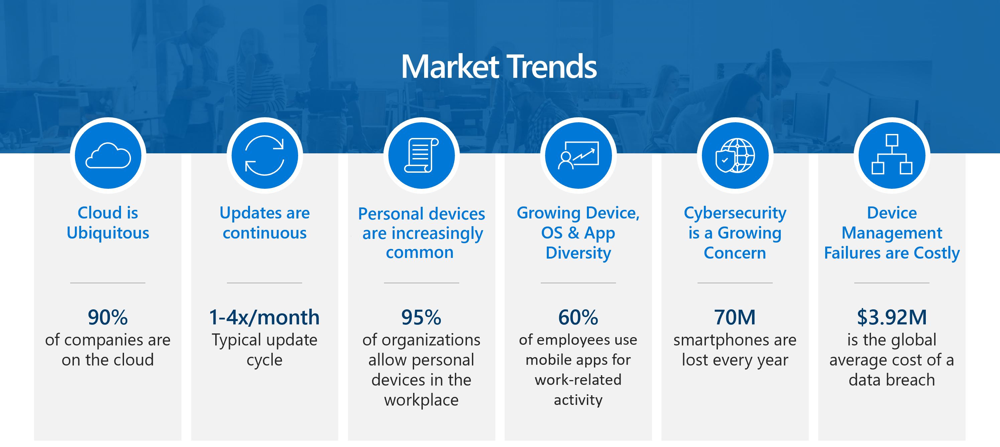

Today, most companies are using cloud services of some kind. Software updates are needed continuously. Organizations often allow personal devices in the workplace. The majority of users use mobile devices and apps for work-related activity. Additionally, cybersecurity continues to be a growing concern when protecting corporate data.

Technology needs are evolving in the modern workplace. IT is adapting to this evolving and changing modern workplace. These changes include the following:

- Users and knowledge workers that were using a single device are now using multiple devices.
- Shared devices such as retail point of sale devices and ruggedized devices are becoming more common.
- Specialized devices such as digital interactive whiteboards, conference room devices, and holographic wearable computers are becoming more common.
- Devices that were business owned are now both user and business owned.
- Users that were solely using the corporate network with legacy apps are now using cloud-managed and SaaS apps as well.
- IT admins that were using manual processes are moving toward automated processes.
- IT admins that spent their time being reactive are now moving toward being automated.
- IT admins that were providing a high-touch environment for their organization are now providing self-service solutions.

## Access to data

Users within your organization must be able to access your organization's data seamlessly and securely. This is apparent whether they're using a corporate device—such as an iOS/iPadOS, Android, Windows, or macOS device—or they're using their own device. Additionally, these users will need to share information with trusted and verified coworkers in a variety of forms, such as from an app or displayed in a web browser. Members of your organization will often use multiple devices, both personal and corporate, to get their work done.  

As an IT admin or business decision maker, you must find modern methods and technologies to successfully manage and protect your organization against advanced digital threats, while still being productive.

You can start by implementing services and tools to protect the digital resources at your organization. These resources often include devices, apps, and data that the people of your organization use to be productive. These same users might also be employees, coworkers, and students. They might open and share personal files, visit unsecured websites, and install potentially unsafe apps. They want to use their devices to access all of their information and resources, whether it's at work, school, or home.

## Protect resources

You can protect resources and devices by using mobile device management (MDM) and mobile application management (MAM) services and tools. MDM enables organizations to protect and secure their resources and data based on enrolled devices. Organization can make sure that only authorized people and devices get access to proprietary information. Similarly, device users can feel at ease accessing work data from their device, such as a phone, because they know their device meets their organization's security requirements. MAM enables organizations to manage and protect their data within an application.

An MDM or MAM solution must accomplish the following tasks:

- Support a diverse mobile environment to securely manage iOS/iPadOS, Android, Windows, and macOS devices.
- Make sure devices and apps are compliant with your organization's security requirements.
- Ensure that all your corporate services are easily available to users on all the devices they use.
- Create and distribute digital policies that help keep your organization's data safe on organization-owned and personal devices.
- Ensure that users get the best possible experience based on first-class support for all the products that they need to use, such as Office, Edge, and other products.
- Use a single, unified mobile solution to enforce these policies, and help manage devices, apps, users, and groups.
- Protect your company information by helping to control the way your workforce accesses and shares its data.

By implementing a management infrastructure, you can provide IT services, apps, protection, and configuration to your users to make them extremely productive. For instance, users can automatically get their certs, wireless network profiles, and VPN settings without having to manually configure them. This allows users to be more productive because they don't have to do any manual configuration, but it also helps users be protected because they have the right settings.

Microsoft Intune combines these services and tools in one location. You may know and already be using these services and tools, including Microsoft Intune, Microsoft Endpoint Configuration Manager, Desktop Analytics, co-management, and Windows Autopilot. These services are part of the Microsoft 365 stack of services to help protect your organization's endpoints, by securing access, protecting data, and responding to and managing risk.

## Learning objectives

In this module, you will:

- Learn what endpoints are and what Microsoft Intune can do for you and your organization.
- Learn about the different products, services, and capabilities that encompass Microsoft Intune.

## Prerequisites

- None
