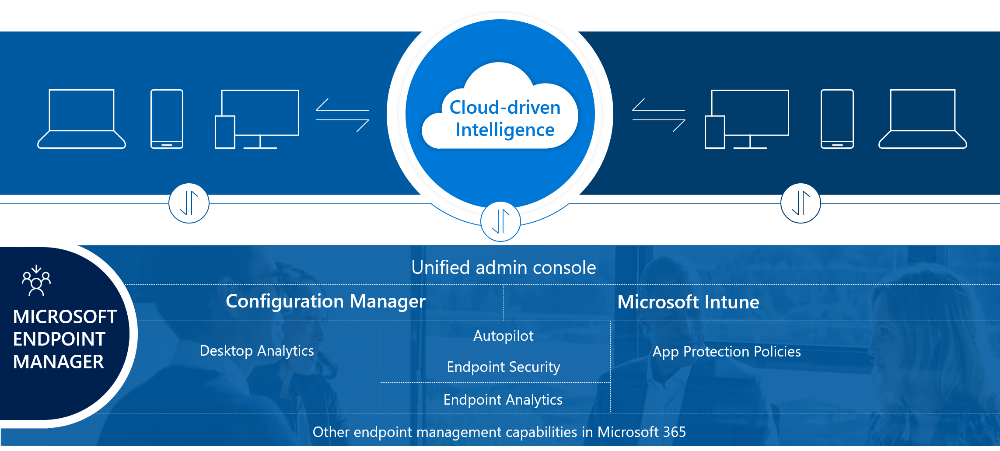

Microsoft Intune is a single, integrated management platform for managing, protecting, and monitoring all of your organization's endpoints.

Endpoints include the mobile devices, desktop computers, virtual machines, embedded devices, servers, and shared devices that your organization uses. Examples of shared and specialized devices include retail point-of-sale devices, ruggedized devices, digital interactive whiteboards, conference-room devices, and holographic wearable computers. Additionally, endpoints also include the apps used by your organization.

By protecting and managing your organization's endpoints using Microsoft Intune, you accomplish the following actions:

- Protect the data that the people at your organization are accessing.
- Ensure your organization is using proper credentials to access and share company data.
- Safeguard the devices and apps that access your organization resources.
- Ensure that new members of your organization have a great experience onboarding to your organization.
- Confirm security rules are in place based on your organizations requirements.
- Confirm that every member of your organization has a device that is configured and protected.
- Ensure that all your corporate services are easily available to end users on all the devices they use.
- Ensure that end users get the best possible experience based on first-class support for all the products that they need to use.

The Microsoft Intune console helps keep your organization's cloud and on-premises devices, apps, and data secure. Intune integrates Microsoft Intune, Microsoft Endpoint Configuration Manager, Desktop Analytics, and Windows Autopilot.

> [!IMPORTANT]
> If you already have Microsoft Intune or Microsoft Endpoint Configuration Manager, you already have Microsoft Intune. These are all now one management system.

To quickly step through the areas of Microsoft Intune, see [Tutorial: Walkthrough Microsoft Intune admin center](/mem/intune/fundamentals/tutorial-walkthrough-endpoint-manager?azure-portal=true).