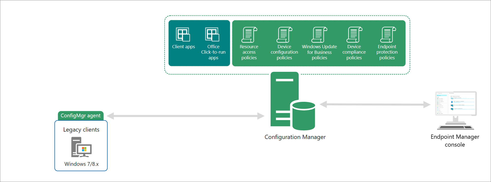

Microsoft Endpoint Configuration Manager is the leading PC-management solution on the market. You use it to manage desktops, servers, and laptops that are on your network or are internet-based. If you use Configuration Manager, you should attach your Configuration Manager deployment to the Microsoft 365 cloud, which will provide integration with Intune, Azure AD, Microsoft Defender ATP, and other cloud services. 

Use Configuration Manager to deploy apps, software updates, and operating systems, as well as configure sites and clients and run and monitor management tasks. Configuration Manager supports Windows and macOS versions. The devices you manage with Configuration Manager can run in virtual environments. This includes Hyper-V on Windows servers as well as Virtual Machines (VM) in Azure. If you run a server as an Azure-based VM, you can install the Configuration Manager client on that device.

