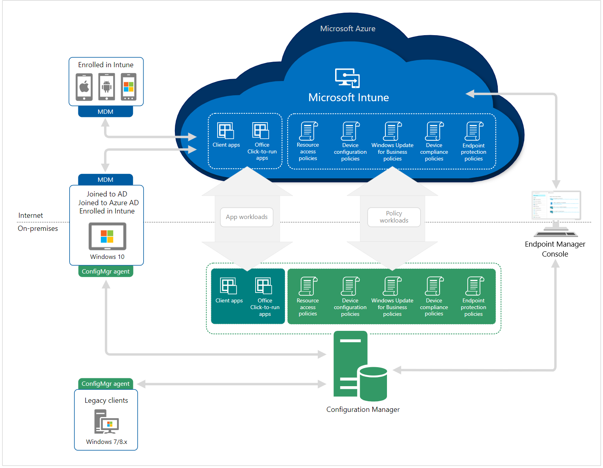

Cloud attach allows you to use both Microsoft Intune and Microsoft Endpoint Configuration Manager from Microsoft Intune.

There are two steps to cloud attach your on-premises devices. The first step of attachment is called **tenant attach**, which is registering your Intune tenant with your Configuration Manager deployment. The second step is called **co-management**, which is concurrently managing Windows 10/11 devices with both Configuration Manager and Microsoft Intune. These are incremental steps on the journey to having full cloud attachment. You get immediate value through tenant attach, and you get extra value through co-management.

#### Tenant attach

Tenant attach allows you to recognize your Configuration Manager devices and infrastructure by the Intune cloud service and take actions from Microsoft Intune. Once you connect Configuration Manager, you gain instant cloud value. Configuration Manager uses the Configuration Manager connector to enable data flow to Microsoft Intune. It requires a connection to an Intune tenant, and doesn't require turning on co-management.

#### Co-management

Co-management is where you concurrently manage Windows 10/11 devices with both Configuration Manager and Microsoft Intune. It combines your existing on-premises Configuration Manager and Active Directory investment with the cloud by using Intune, Azure AD, and other Microsoft 365 cloud services. You choose whether Configuration Manager or Intune is the management authority. You keep some tasks on-premises, while running other tasks in the cloud with Intune.

There are two main paths to reach co-management:

- **Existing Configuration Manager clients**: You have Windows 10/11 devices that are already Configuration Manager clients. You set up hybrid Azure AD and enroll them into Intune.  
- **New internet-based devices**: You have new Windows 10/11 devices that join Azure AD and automatically enroll to Intune. You install the Configuration Manager client to reach a co-management state.  

When you enroll existing Configuration Manager clients in co-management, you gain the following immediate value:

- Conditional Access with device compliance  
- Intune-based remote actions, such as restart, remote control, or factory reset
- Centralized visibility of device health  
- Link users, devices, and apps with Azure Active Directory (Azure AD)  
- Modern provisioning with Windows Autopilot  

In the following diagram, you can see how Windows 10/11 devices can be managed with both Configuration Manager and Microsoft Intune:

