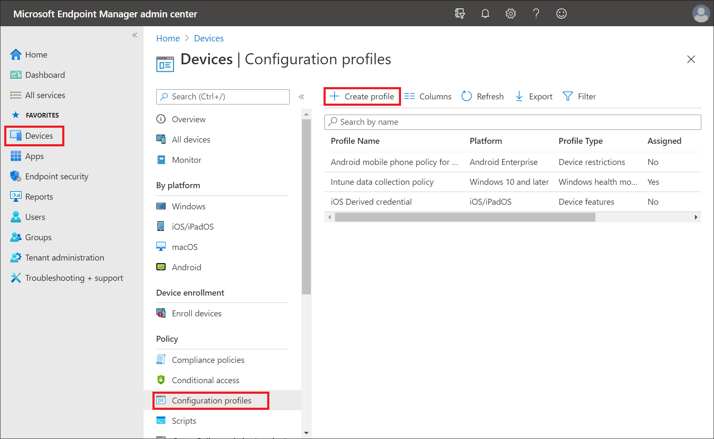

Enrolling your devices is just the first step. When you configure devices in your organization, you can apply settings and features to be enabled or disabled. These settings and features are added to *configuration profiles*. You can create profiles for different devices and different platforms, including iOS/iPadOS, Android device administrator, Android Enterprise, and Windows. Then, use Intune to apply or "assign" the profile to the devices.

As part of your mobile device management (MDM) solution, use these configuration profiles to complete different tasks. Some profile examples include:

- On Windows 10/11 devices, use a profile template that blocks ActiveX controls in Internet Explorer.
- On iOS/iPadOS and macOS devices, allow users to use AirPrint printers in your organization.
- Allow or prevent access to Bluetooth on the device.
- Create a WiFi or VPN profile that gives different devices access to your corporate network.
- Manage software updates, including when they're installed.
- Run an Android device as dedicated kiosk device that can run one app, or run many apps.
