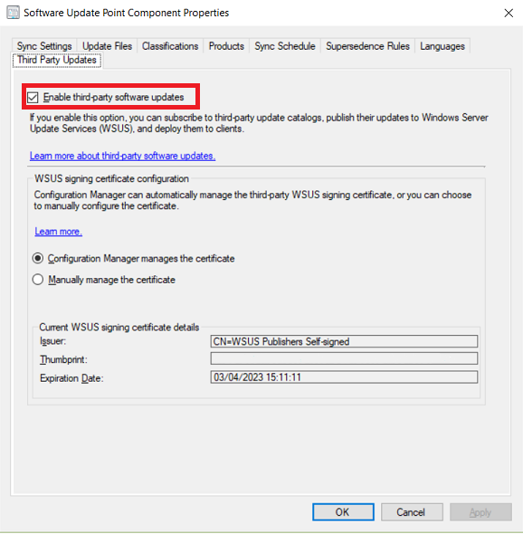

In the modern IT world, protecting devices from unauthorized access is one of the most important tasks that you perform. In addition to the items in the **Configure** step of the device lifecycle, Intune provides capabilities that help protect devices you manage from unauthorized access or malicious attacks. For example, you can restrict use of hardware features on the device, such as the camera or Bluetooth.

You can require devices to be compliant. Intune features device-compliance policies that let you evaluate (and in some cases remediate) devices that aren't compliant with rules that you specify. For example, you can get reports on the following device characteristics before taking action:

- Jailbroken iOS/iPadOS devices
- Encrypted or unencrypted devices
- The health of Windows 10/11 devices (as determined by the Health Attestation Service)

You can protect apps and the data they use. Intune gives you a range of features to help you protect apps and their data. For example, mobile application management (MAM) policies can:

- Prevent data from being backed up from a protected app.
- Restrict copy and paste to other apps.
- Require a PIN to access an app.

You can also add an additional layer of protection to devices, such as:

- **Multi-factor authentication**: Adding an extra layer of authentication to user sign-ins can help make devices even more secure. Many devices support multi-factor authentication that requires a second level of authentication such as a phone call or text message before users can gain access.
- **Windows Hello for Business settings**: Windows Hello for Business is an alternative sign-in method that lets users use a *gesture*—such as a fingerprint or Windows Hello—to sign in without needing a password.

> [!NOTE]
> As part of protecting devices, you use Conditional Access. Conditional Access makes sure that only trusted users can access organizational resources on trusted devices using trusted apps. We'll cover Conditional Access later in this module.

## Software updates

An effective software update management process is necessary to maintain operational efficiency, overcome security issues, and maintain the stability of the network infrastructure. However, because of the changing nature of technology and the continual appearance of new security threats, effective software update management requires consistent and continual attention. Both Intune and Configuration Manager can help you effectively update your organization's devices.

### Intune software updates

Intune can help you to secure your managed computers in a number of ways, including the management of software updates that keep your computers up-to-date by ensuring the latest patches and software updates are quickly installed.

### Configuration Manager software updates

Software updates in Configuration Manager provide a set of tools and resources that can help manage the complex task of tracking and applying software updates to client computers in the enterprise.

