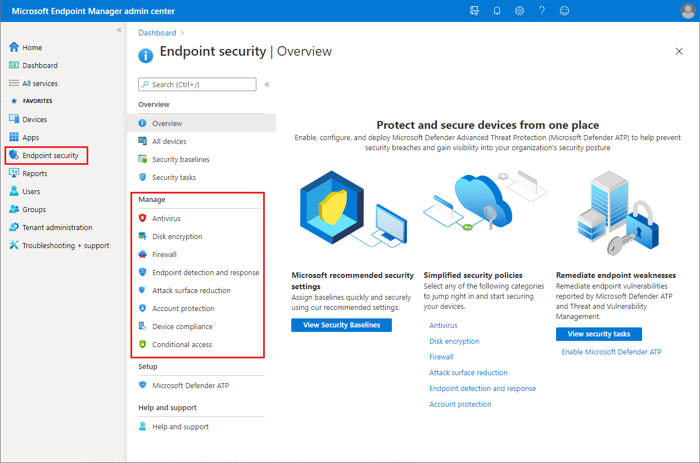

You can use the *Endpoint security* node in Microsoft Intune to configure device security and to manage security tasks for devices when those devices are at risk. The Endpoint security policies are designed to help you focus on the security of your devices and mitigate risk. The tasks that are available help you identify devices that are at risk, to remediate those devices, and restore them to a compliant or more secure state.

The Endpoint security node groups the tools that are available through Intune that you use to keep devices secure:

- **Review the status of all your managed devices**: You can view device compliance from a high level and drill into specific devices to understand which compliance policies aren't met so you can resolve them.
- **Deploy security baselines that establish best practice security configurations for devices**: Intune includes security baselines for Windows devices and a growing list of applications, like Microsoft Defender for Endpoint and Microsoft Edge. Security baselines are pre-configured groups of Windows settings that help you apply a known group of settings and default values that the relevant security teams recommend. You can use security baselines to rapidly deploy a *best practice* configuration of device and application settings to protect your users and devices. Security baselines are supported for devices that run Windows 10 version 1809 and later.
- **Manage security configurations on devices through tightly focused policies**: Each endpoint-security policy focuses on aspects of device security like antivirus, disk encryption, firewalls, and several areas made available through integration with Microsoft Defender for Endpoint.
- **Establish device and user requirements through compliance policy**: With compliance policies, you set the rules devices and users must meet to be considered compliant. Rules can include OS versions, password requirements, device-threat levels, and more. When you integrate with Azure Active Directory (Azure AD) Conditional Access policies to enforce compliance policies, you can gate access to corporate resources for both managed devices and devices that aren’t managed yet. Endpoint security policies are one of several methods in Intune to configure settings on devices. When managing settings, it's important to understand what other methods are in use in your environment that can configure your devices, and avoid conflicts.
- **Integrate Intune with your Microsoft Defender for Endpoint**: By integrating with Microsoft Defender for Endpoint, you gain access to security tasks. Security tasks closely tie Microsoft Defender for Endpoint and Intune together to help your security team identify devices that are at risk and hand off detailed remediation steps to Intune admins who can then act.
- **Integrate Configuration Manager with Microsoft Defender for Endpoint**: Using tenant attach in a co-managed endpoint management scenario, you can integrate Configuration Manager with Microsoft Defender for Endpoint to gain access to security tasks that help enterprises detect, investigate, and respond to advanced attacks on their networks.
