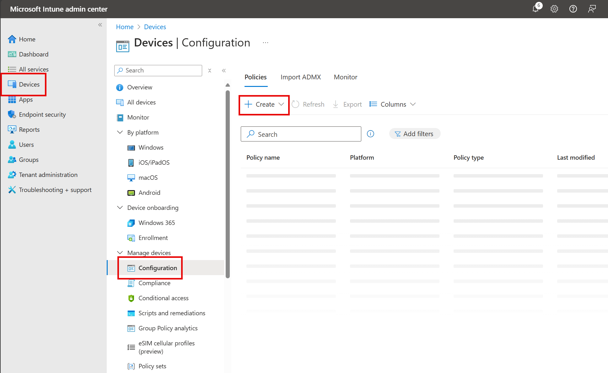

You can create and apply device policies as part of your efforts to protect endpoints. Microsoft Intune helps you protect the devices you manage and the data stored on those devices. Protected devices are also known as managed devices. Intune includes settings and features you can enable or disable for different devices within your organization. These settings and features are added to *configuration profiles*. You can create profiles for different devices and different platforms, including iOS/iPadOS, macOS, Android, Android Enterprise, and Windows. Then, use Intune to apply or "assign" the profile to the devices.

## Types of device policies

Device policies allow you to perform several different types of actions to protect devices. For instance, device policies allow the following types of actions on the devices at your organization:

- Restrict
- Reset
- Require
- Configure
- Protect
- Control
- Retire

## Examples of device configuration policies

Intune configuration policies help you protect and configure devices by allowing you to control a multitude of settings and features. For example, you can:

- Restrict use of hardware features on the device, such as the camera or Bluetooth.
- Reset passcodes when users are locked out of their devices.
- Require devices to be compliant with the protection requirements implemented by your organization, such as requiring each device to use a PIN to access the device.
- Configure compliant and noncompliant apps. You'll get an alert if a noncompliant app is installed (and some platforms can actually block the install).
- Protect apps and the data they use.
- Protect devices based on identity by adding an extra layer of protection to devices.
- Control Windows Hello for Business settings, which is an alternative sign-in method for Windows 10 and later.
- Retire devices and remove data.
- Configure email by allowing end users to access company email on their personal devices without any required setup on their part.
