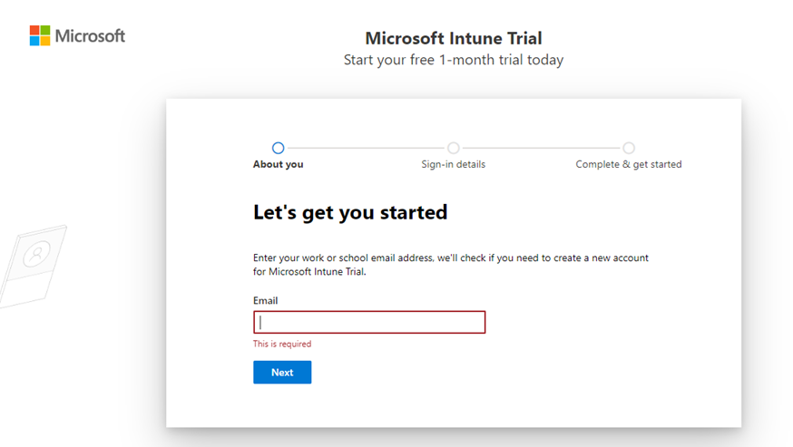
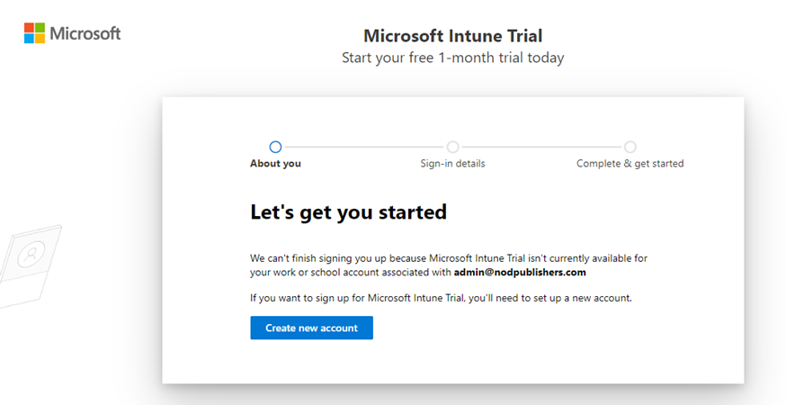
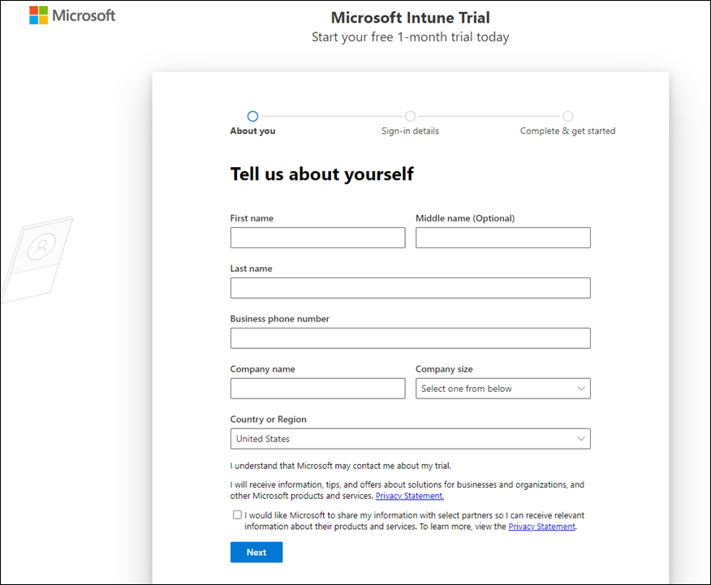
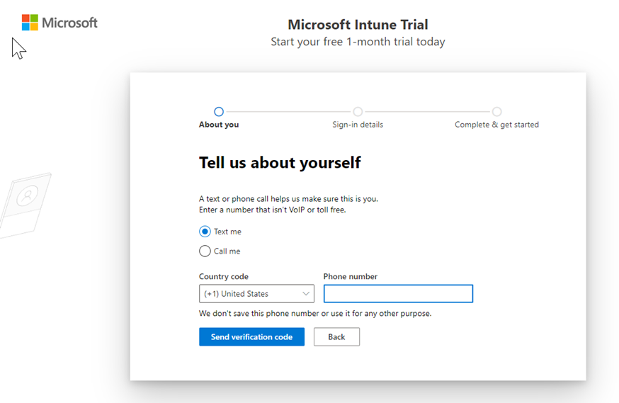
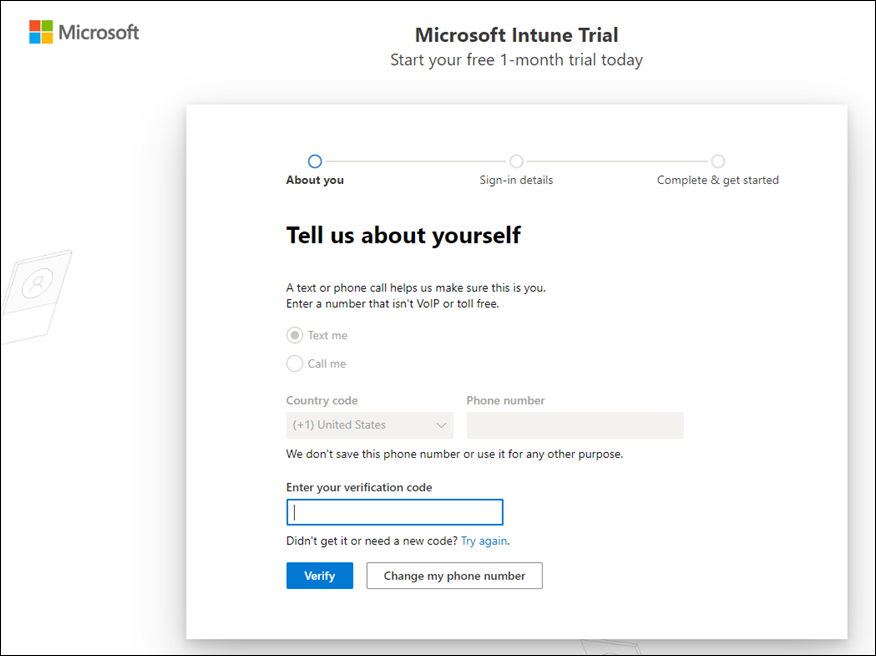
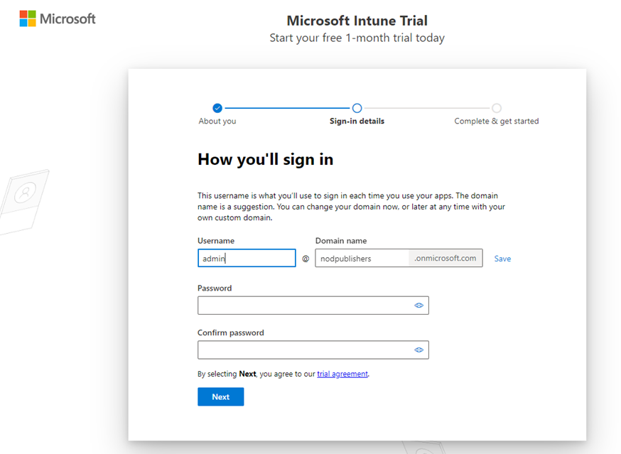

When you sign up for the Intune free trial, you create a new Intune trial subscription using your work or school account. The trial subscription last 30 days. If you choose, you can convert the trial subscription to a full subscription based on your choice of product licenses. If you already are using your work or school account for a Microsoft service, you can **sign in** with that account and add Intune to your subscription. If you're uncertain whether you have an existing account, you can follow the Intune free trial sign-up steps below to check whether you need to create a new account for Intune.

>[!WARNING]
>You can't combine an existing work or school account after you sign up for a new account.

When you complete the sign up process, you'll have a new tenant. A tenant is a dedicated instance of Azure Active Directory (Azure AD) where your subscription to Intune is hosted. You can then configure the tenant, add users and groups, and assign licenses to users. When you're ready, you can help users enroll their devices and add apps that they need to begin the modern endpoint management process. As you continue, you can set configuration and protection policies, as well as other endpoint management capabilities.

## Sign up for the Intune free trial

To sign up for the Microsoft Intune free trial, follow the steps below:

1. Navigate to the [Intune set up account page](https://admin.microsoft.com/Signup/Signup.aspx?azure-portal=true&OfferId=40BE278A-DFD1-470a-9EF7-9F2596EA7FF9&dl=INTUNE_A&ali=1#0%20).

2. Enter your email address and click **Next**.

   > [!NOTE]
   > If you already have an account set up with another Microsoft service using your email address, you can choose to sign in to use the account with the Intune trial, or you can create a new account. These steps assume you are creating a new account.

   

3. Click **Set up account** to create a new account.

   

4.  Add your name, phone number, company name, company size, and region. Then, click **Next**.

      

5. Click **Send Verification Code** to verify the phone number you added.

      

6. Enter the verification code you receive on your mobile device, then click **Verify**.

      

7. Add a domain name for your trial that represents your business or organization. Your name will be added before *.onmicrosoft.com*. Click **Check availability** > **Next**. If you like, you can later change this domain name to your custom domain name.

      

8. Add your user name and password that you'll use to log in to Microsoft Intune. Review the trial agreement and privacy statement. Click **Sign up** to create your account.

    > [!IMPORTANT]
    > Be sure to make a note of your user name and password.

      

9. After your account has been created, you'll see your user name. You'll use this user name to log in to Intune. Additionally, you receive an email message that contains your account information at the email address that you provided during the sign-up process. This email confirms your subscription is active.

## Sign in to Microsoft Intune

Once you have signed up for Intune, you can use any device with a [supported browser](/mem/intune/fundamentals/supported-devices-browsers?azure-portal=true#intune-supported-web-browsers) to sign in to the [Microsoft Endpoint Manager admin center](https://go.microsoft.com/fwlink/??zure-portal=true&linkid=2109431) to administer the Intune service.

> [!NOTE]
> Microsoft Intune is a part of Microsoft Endpoint Manager. Microsoft Endpoint Manager is the overall management platform for managing, protecting, and monitoring all of your organization's endpoints.

1. In a supported web browser, navigate to the [Microsoft Endpoint Manager admin center](https://go.microsoft.com/fwlink/?azure-portal=true&linkid=2109431).
2. Sign in using your newly created user name and password.

## View Microsoft Intune free trial details

To view the Intune product details for your free trial, use the following steps:

1. Sign in to the [Microsoft 365 admin center](https://go.microsoft.com/fwlink/p/?LinkId=698854).
2. Select **Your products** > **Microsoft Intune Trial**.

The **Microsoft Intune Trial** pane provides license, subscription, and product details.